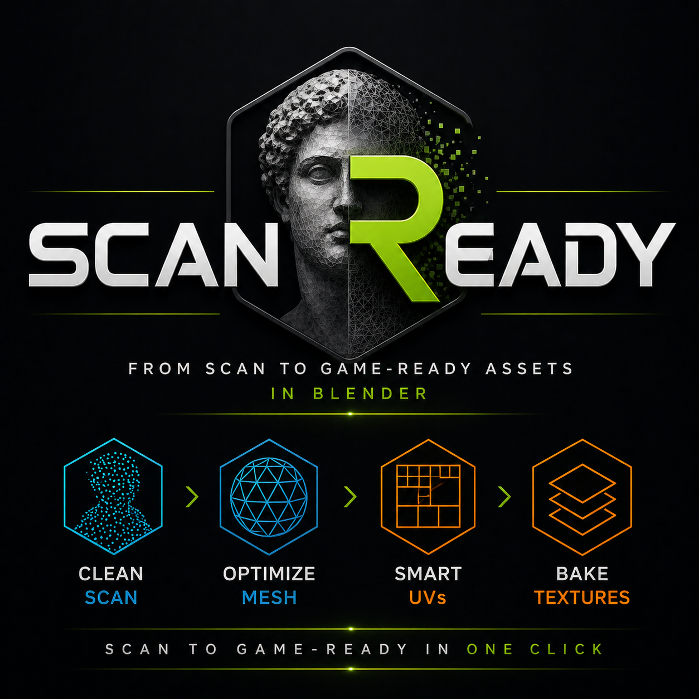

# ScanReady

Convert high-poly scans into optimized, game-ready assets in one click.

  

  <b>Clean Scan → Optimize Mesh → Smart UVs → Bake Textures</b>

---

## 🚀 What is ScanReady?

**ScanReady** is a Blender addon designed to convert heavy high-poly scans into optimized, game-ready assets through a guided and automated workflow.

It is built for artists, game developers, photogrammetry users and cultural heritage workflows who need to clean, optimize, unwrap and bake scanned assets faster.

---

## ⚡ One Click Bake

The fastest way to use ScanReady is the **ONE CLICK BAKE** workflow.

ScanReady automatically performs:

- Mesh optimization
- Smart UV generation
- Auto cage setup
- Texture baking
- Final asset creation

> Start with One Click Bake for most scans. Use manual steps only when you need more control.

---

## 🔥 Key Features

| Feature | Description |
|---|---|
| **One Click Workflow** | Runs the full scan-to-game-ready pipeline automatically. |
| **Smart UV** | Generates UVs using a scan-friendly Smart UV workflow. |
| **Auto Cage** | Creates a baking cage without manual setup. |
| **Multi-material Bake** | Supports multiple texture sets for complex scans. |
| **Memory Safety** | Helps reduce crashes during heavy bake operations. |
| **Preserve Sharp Details** | Keeps important surface definition during optimization. |

---

## 🧩 Workflow Overview

ScanReady follows a simple 3-step workflow:

### 1. Preview / Reduce

Create an optimized lowpoly preview from your high-poly scan.

### 2. UV / Cage

Generate Smart UVs and prepare the baking cage.

### 3. Bake / Output

Bake textures and create the final game-ready asset.

---

## 🎯 Recommended Use Cases

ScanReady is ideal for:

- Photogrammetry scans
- Cultural heritage assets
- Game props
- Environment objects
- Real-world captured models
- VR / AR optimized assets

---

## 📦 What ScanReady Creates

After the workflow, ScanReady can generate:

- Optimized lowpoly mesh
- UV-ready object
- Baking cage
- Final baked mesh
- Texture files saved to output folder

---

## 🚀 Get Started

New users should begin here:

[Quick Start](quick-start.md)

For the full workflow, continue with:

[One Click Bake](one-click.md)
