# Impostazioni avanzate

Le impostazioni avanzate danno controllo preciso su pulizia mesh, riduzione adattiva, generazione UV, qualità bake, output immagini, preset, diagnostica e sicurezza memoria.

Advanced è la parte più tecnica di ScanReady. Qui puoi modificare il cuore del workflow quando vuoi andare oltre il risultato automatico, rifinire una scansione difficile o adattare il processo a un asset pensato per VR, videogame o realtime.

Non serve cambiare ogni impostazione per usare ScanReady. Per la maggior parte delle scansioni, parti dai valori predefiniti e intervieni solo quando hai bisogno di più controllo su qualità, performance, accuratezza del bake o protezione dei dettagli.

Il pannello Advanced raccoglie le impostazioni che influenzano le fasi principali del processo: cleanup della scansione, riduzione adattiva, generazione UV, bake delle texture, gestione memoria, preset e diagnostica.

Usalo in modo graduale: prima crea una preview low-poly con i valori predefiniti, poi torna in Advanced solo se vuoi correggere qualcosa o migliorare il risultato. Se cambi impostazioni che influenzano mesh, Adaptive Reduce o UV, rigenera lo step corrispondente prima di continuare.

Le sezioni principali seguono l'ordine del workflow. Mesh Settings prepara e pulisce la scansione prima della preview low-poly. Adaptive Reduce controlla come ScanReady protegge dettagli, bordi e cambi di normale durante la riduzione. UV Settings gestisce l'apertura UV usata dal bake.

Bake Settings e Occlusion Settings regolano qualità, margini, normal map, roughness e occlusion. Memory Safety, Preset, Diagnostics e Utilities aiutano nei workflow pesanti, nei test, nel riuso delle impostazioni e nel ripristino rapido di una configurazione pulita.

  
<strong>Advanced</strong>

  <!-- Sostituire con ../../img/advanced-overview.png -->
  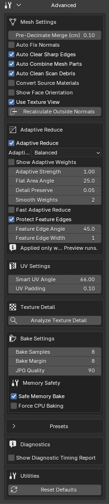

# Mesh Settings

Queste impostazioni controllano pulizia scansione e preparazione mesh prima di generare la preview low-poly.

  
<strong>Mesh Settings</strong>

  <!-- Sostituire con ../../img/advanced-mesh-settings.png -->
  

<h3>Pre-Decimate Merge</h3>

Esegue una pulizia Merge by Distance sulla mesh preview duplicata prima che venga aggiunto il modificatore Decimate.

È il singolo controllo esplicito di weld in ScanReady. Può aiutare a ridurre poligoni sovrapposti della scansione prima dell'ottimizzazione. Se dopo l'ottimizzazione compaiono buchi nel modello o vengono colpiti dettagli sottili, abbassa il valore e crea di nuovo la preview low-poly.

  
<strong>Pre-Decimate Merge</strong>

  <!-- Sostituire con ../../img/advanced-pre-decimate-merge.png -->
  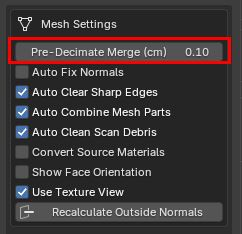

<h3>Auto Fix Normals</h3>

Ricalcola automaticamente le normali della mesh high-poly prima di creare la preview low-poly.

Attivalo quando la scansione ha normali invertite, shading rotto o artefatti di bake causati da direzioni normali errate.

  
<strong>Auto Fix Normals</strong>

  <!-- Sostituire con ../../img/advanced-auto-fix-normals.png -->
  

  <!-- Sostituire con ../../img/advanced-auto-fix-normals-detail.png -->
  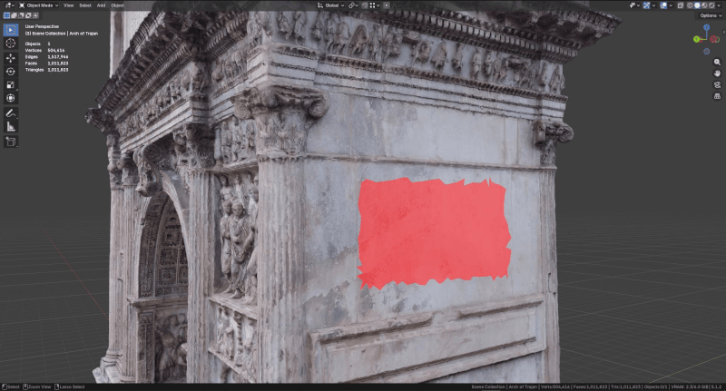

<h3>Auto Clear Sharp Edges</h3>

Rimuove automaticamente marcature sharp edge dalla mesh durante la preparazione.

È utile quando una scansione importata contiene edge marcati come sharp in modo non desiderato, causando shading duro o bake meno puliti.

  
<strong>Auto Clear Sharp Edges</strong>

  <!-- Sostituire con ../../img/advanced-auto-clear-sharp-edges.png -->
  

  <!-- Sostituire con ../../img/advanced-auto-clear-sharp-edges-detail.png -->
  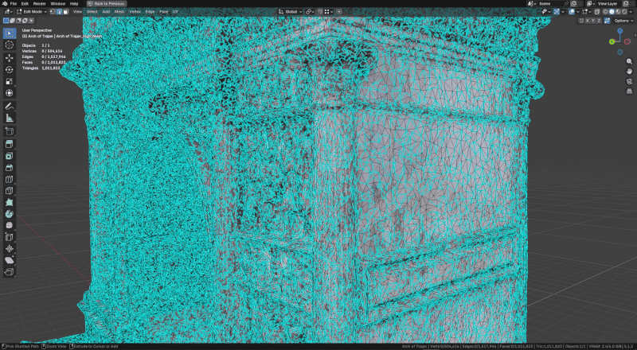

<h3>Auto Combine Mesh Parts</h3>

Combina automaticamente più parti mesh della scansione quando lavori con import composti da molti oggetti separati. È attivo di default.

ScanReady controlla da solo se la selezione contiene una gerarchia con tante mesh da unire. Se la scansione è già una mesh unica, non esegue nessuna unione.

Lascialo attivo nella maggior parte dei casi, soprattutto con scansioni da fotogrammetria, GLB o FBX divisi in più elementi. Disattivalo solo se l'unione automatica crea problemi o se vuoi mantenere intenzionalmente parti mesh separate.

  
<strong>Auto Combine Mesh Parts</strong>

  <!-- Sostituire con ../../img/advanced-auto-combine-mesh-parts.png -->
  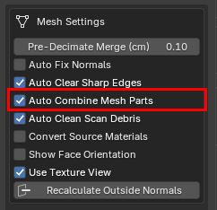

  <!-- Sostituire con ../../img/advanced-auto-combine-mesh-parts-detail.png -->
  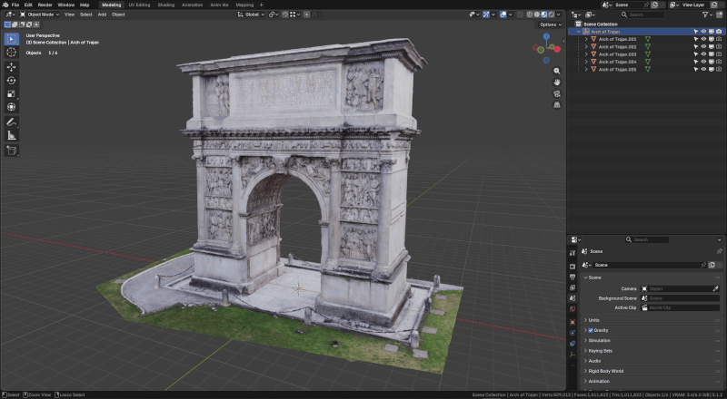

<h3>Auto Clean Scan Debris</h3>

Rimuove detriti comuni della scansione, come frammenti isolati, poligoni sospesi e vertici non utili prima della riduzione.

È attivo di default perché molte scansioni grezze contengono piccole parti volanti che possono rallentare ottimizzazione, UV e bake.

  
<strong>Auto Clean Scan Debris</strong>

  <!-- Sostituire con ../../img/advanced-auto-clean-scan-debris.png -->
  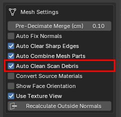

  <!-- Sostituire con ../../img/advanced-auto-clean-scan-debris-detail.png -->
  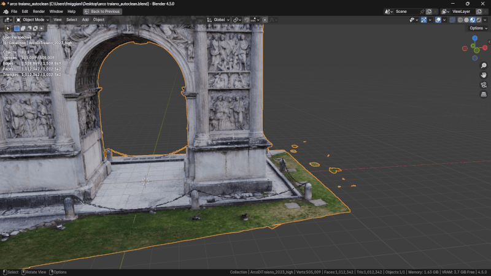

<h3>Convert Source Materials</h3>

Converte i materiali sorgente della scansione in una configurazione più pulita e prevedibile per il workflow di ScanReady.

Alcuni modelli importati, soprattutto da file GLB, Sketchfab o librerie online, possono usare materiali complessi o collegamenti poco adatti al bake. Per esempio, una texture diffuse può essere collegata all'Emission invece che al Base Color.

Quando questa opzione è attiva, ScanReady ricostruisce i materiali usando uno shader standard <strong>Principled BSDF</strong> di Blender. Questo rende il bake più coerente e aiuta a evitare risultati strani causati da shader importati troppo complessi.

Lascialo disattivato se vuoi mantenere i materiali sorgente il più possibile invariati. Attivalo quando i materiali importati sono complessi, non vengono letti correttamente, oppure producono un bake poco prevedibile.

  
<strong>Convert Source Materials</strong>

  <!-- Sostituire con ../../img/advanced-convert-source-materials.png -->
  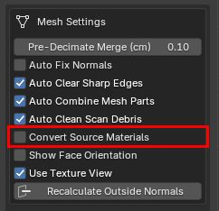

  <!-- Sostituire con ../../img/advanced-auto-clean-scan-debris-detail.png -->
  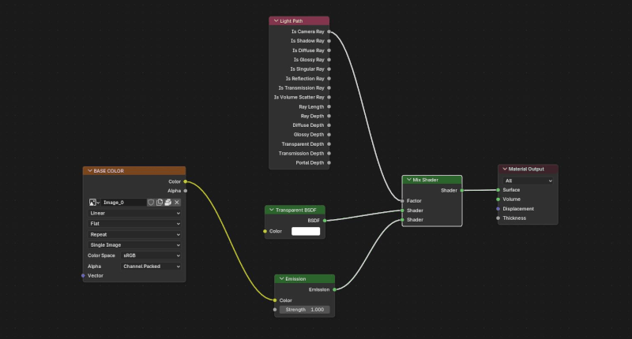

<h3>Show Face Orientation</h3>

Mostra l'overlay <strong>Face Orientation</strong> di Blender per controllare rapidamente se le facce del modello sono orientate nel verso corretto.

In Blender le facce hanno una direzione: un lato è considerato esterno e l'altro interno. Se alcune facce sono invertite, il modello può sembrare corretto nella viewport, ma durante il bake può creare problemi come zone nere, dettagli mancanti, ombre sbagliate o texture trasferite male.

Usa <strong>Show Face Orientation</strong> prima di creare la preview low-poly o prima del bake per verificare che la scansione non abbia normali invertite. Le facce evidenziate in rosso indicano normalmente superfici orientate al contrario e possono causare problemi durante il bake.

Quando attivi <strong>Show Face Orientation</strong>, ScanReady disattiva automaticamente <strong>Backface Culling</strong> per evitare controlli visivi sovrapposti.

  
<strong>Show Face Orientation</strong>

  <!-- Sostituire con ../../img/advanced-show-face-orientation.png -->
  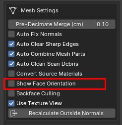

  <!-- Sostituire con ../../img/advanced-show-face-orientation-detail.png -->
  

<h3>Backface Culling</h3>

Attiva il <strong>Backface Culling</strong> del viewport per controllare come si comportano le facce quando vengono viste dal lato posteriore.

È una modalità di visualizzazione utile per individuare possibili problemi nella scansione, come facce invertite, superfici a una sola faccia, buchi, parti aperte o aree con orientamento sospetto.

Questo controllo è importante prima del bake: anche se il modello può sembrare corretto nella viewport, facce orientate male o parti aperte possono causare texture nere, dettagli mancanti, ombre errate o trasferimenti non corretti dalla mesh high-poly alla mesh ottimizzata.

<strong>Backface Culling</strong> è solo una modalità di preview: non modifica la mesh e non cambia direttamente il bake. Serve a controllare meglio la scansione prima di procedere.

Backface Culling e Show Face Orientation sono collegati: se attivi uno, ScanReady disattiva automaticamente l'altro. In questo modo controlli la scansione con una sola modalità diagnostica alla volta.

  
<strong>Backface Culling</strong>

  <!-- Sostituire con ../../img/advanced-backface-culling.png -->
  

  <!-- Sostituire con ../../img/advanced-backface-culling-detail.png -->
  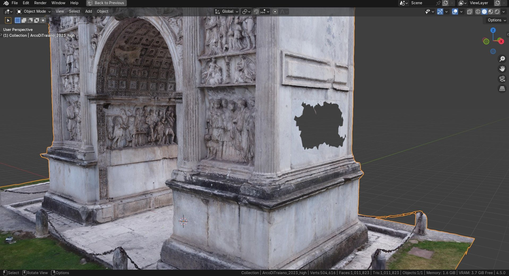

<h3>Use Texture View</h3>

Mostra il modello in una visualizzazione piatta senza illuminazione di scena.

È utile per ispezionare più chiaramente risultati texture bake o preview.

  
<strong>Use Texture View</strong>

  <!-- Sostituire con ../../img/advanced-use-texture-view.png -->
  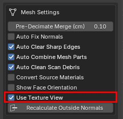

  <!-- Sostituire con ../../img/advanced-use-texture-view-detail.png -->
  

<h3>Recalculate Outside Normals</h3>

Esegue manualmente il ricalcolo delle normali sulla mesh high-poly selezionata.

Usalo quando la scansione appare rovesciata o ha shading incoerente.

  
<strong>Recalculate Outside Normals</strong>

  <!-- Sostituire con ../../img/advanced-recalculate-outside-normals.png -->
  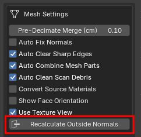

  <!-- Sostituire con ../../img/advanced-recalculate-outside-normals-detail.png -->
  

---

# Adaptive Reduce

Adaptive Reduce controlla come ScanReady distribuisce la riduzione sulla scansione selezionata.

È attivo di default ed è progettato per proteggere il dettaglio visivamente importante, permettendo alle superfici piatte di essere semplificate di più.

I pesi Adaptive Reduce vengono calcolati quando clicchi <strong>Create Low-poly Preview</strong>. Cambiare <strong>Optimize / Reduce</strong> o <strong>Final Faces</strong> dopo quel momento aggiorna la quantità di riduzione, ma non ricalcola i pesi adattivi. Per applicare un preset Adaptive Reduce diverso o valori adattivi dettagliati, crea di nuovo la preview low-poly.

  
<strong>Adaptive Reduce</strong>

  <!-- Sostituire con ../../img/advanced-adaptive-reduce.png -->
  

<h3>Adaptive Reduce</h3>

Abilita o disabilita il sistema di riduzione adattiva.

Quando è attivo, ScanReady analizza la mesh e crea pesi per proteggere dettagli importanti, bordi e cambi di normale, semplificando di più le aree piatte o meno rilevanti.

  
<strong>Adaptive Reduce</strong>

  <!-- Sostituire con ../../img/advanced-adaptive-reduce.png -->
  

<h3>Adaptive Reduce Preset</h3>

Scegli il preset più adatto alla scansione e all'asset target.

<ul>
<li><strong>Balanced</strong> è il preset predefinito per la maggior parte delle scansioni.</li>
<li><strong>Preserve Details</strong> protegge più fortemente regioni complesse o importanti della superficie.</li>
<li><strong>Flat Surfaces</strong> riduce in modo più aggressivo le aree ampie e semplici.</li>
<li><strong>Hard Surface</strong> è un preset approssimato più veloce per veicoli e scansioni hard-surface; protegge solo rotture di normale più forti.</li>
</ul>

  
<strong>Adaptive Reduce Preset</strong>

  <!-- Sostituire con ../../img/advanced-adaptive-reduce-preset.png -->
  

<h3>Show Adaptive Weights</h3>

Mostra una preview a colori di come ScanReady distribuirà la riduzione sulla scansione.

Le aree rosse rappresentano superfici più piatte che possono essere ridotte di più. Le aree blu e verdi rappresentano regioni protette per il dettaglio.

La visualizzazione è solo un aiuto di preview. Serve a scegliere il preset e capire il comportamento della riduzione; non è una texture esportata o baked.

I pesi Adaptive Reduce vengono calcolati quando clicchi <strong>Create Low-poly Preview</strong>. Dopo che la preview esiste, cambiare <strong>Optimize / Reduce</strong> o <strong>Final Faces</strong> aggiorna la quantità di riduzione usando i pesi esistenti. Se cambi preset o valori dettagliati di Adaptive Reduce, clicca di nuovo <strong>Create Low-poly Preview</strong> per ricostruire i pesi con le nuove impostazioni.

Usa questa preview quando una scansione ha superfici miste, come pannelli architettonici piatti insieme a dettagli scultorei o danneggiati.

  
<strong>Show Adaptive Weights</strong>

  <!-- Sostituire con ../../img/advanced-show-adaptive-weights.png -->
  

<h3>Adaptive Reduce Strength</h3>

Controlla quanto fortemente i pesi adattivi influenzano la riduzione.

Valori più alti rendono più marcata la differenza tra aree protette e aree semplificate. Valori più bassi producono un comportamento più vicino a una riduzione uniforme.

  
<strong>Adaptive Reduce Strength</strong>

  <!-- Sostituire con ../../img/advanced-adaptive-reduce-strength.png -->
  

<h3>Adaptive Reduce Angle</h3>

Controlla la sensibilità ai cambi di normale usati per distinguere aree piatte, curvature e dettagli.

Valori più bassi rendono ScanReady più sensibile alle variazioni di superficie. Valori più alti tendono a considerare più aree come relativamente uniformi.

  
<strong>Adaptive Reduce Angle</strong>

  <!-- Sostituire con ../../img/advanced-adaptive-reduce-angle.png -->
  

<h3>Detail Preserve</h3>

Regola quanta protezione viene data ai dettagli della superficie durante il calcolo dei pesi.

Aumentalo quando la scansione contiene dettagli fini che non vuoi perdere. Abbassalo quando vuoi una riduzione più aggressiva.

  
<strong>Detail Preserve</strong>

  <!-- Sostituire con ../../img/advanced-detail-preserve.png -->
  

<h3>Smooth Weights</h3>

Smussa i pesi Adaptive Reduce per rendere la transizione tra aree protette e aree ridotte più omogenea.

Valori più alti possono produrre una distribuzione meno frastagliata, utile su scansioni rumorose o superfici irregolari.

  
<strong>Smooth Weights</strong>

  <!-- Sostituire con ../../img/advanced-smooth-weights.png -->
  

<h3>Fast Adaptive Reduce</h3>

Usa una modalità più veloce e approssimata del calcolo adattivo.

È utile per preview rapide o asset hard-surface, perché riduce il tempo di analisi saltando parte della rifinitura regionale. I bordi con normali molto diverse restano comunque protetti.

  
<strong>Fast Adaptive Reduce</strong>

  <!-- Sostituire con ../../img/advanced-fast-adaptive-reduce.png -->
  

<h3>Protect Feature Edges</h3>

Protegge bordi importanti e rotture nette della superficie durante la riduzione.

È consigliato per scansioni hard-surface, veicoli, architettura, oggetti con spigoli visibili o silhouette importanti.

  
<strong>Protect Feature Edges</strong>

  <!-- Sostituire con ../../img/advanced-protect-feature-edges.png -->
  

<h3>Feature Edge Angle</h3>

Definisce l'angolo minimo usato per considerare un bordo come feature edge da proteggere.

Valori più bassi proteggono più bordi. Valori più alti proteggono solo cambi di direzione più netti.

  
<strong>Feature Edge Angle</strong>

  <!-- Sostituire con ../../img/advanced-feature-edge-angle.png -->
  

<h3>Feature Edge Rings</h3>

Estende la protezione dei feature edge anche agli anelli di geometria vicini.

Può aiutare a mantenere più stabile la forma attorno a bordi netti, cornici, pannelli o separazioni evidenti della scansione.

  
<strong>Feature Edge Rings</strong>

  <!-- Sostituire con ../../img/advanced-feature-edge-rings.png -->
  

---

# UV Settings

Queste impostazioni controllano come Smart UV Project apre la mesh ottimizzata.

<blockquote>

<strong>Nota:</strong> le impostazioni UV vengono applicate quando ScanReady genera le UV.

Se cambi valori UV dopo aver già creato il layout, clicca di nuovo <strong>Generate UVs</strong> oppure esegui <strong>One Click Bake</strong> dall'inizio.

<strong>Bake Textures</strong> usa sempre il layout UV già esistente al momento del bake.

</blockquote>

  
<strong>UV Settings</strong>

  <!-- Sostituire con ../../img/advanced-uv-settings.png -->
  

<h3>Smart UV Angle</h3>

Controlla quanto Smart UV Project divide la mesh in isole UV.

<ul>
<li>Valori più bassi creano più tagli e più isole UV.</li>
<li>Valori più alti creano isole più grandi.</li>
</ul>

Puoi regolare manualmente questo valore quando vuoi più controllo sull'unwrap usato per il bake.

I preset Adaptive Reduce sono separati dalla generazione UV: Adaptive Reduce controlla la semplificazione della mesh, mentre Smart UV Project controlla l'apertura UV.

  
<strong>Smart UV Angle</strong>

  <!-- Sostituire con ../../img/advanced-smart-uv-angle.png -->
  

<h3>UV Padding</h3>

Imposta lo spazio tra le isole UV.

Aumenta il padding per ridurre texture bleeding, soprattutto a risoluzioni texture più basse.

  
<strong>UV Padding</strong>

  <!-- Sostituire con ../../img/advanced-uv-padding.png -->
  

---

# Bake Settings

Queste impostazioni controllano qualità bake, padding texture, qualità formato immagine, analisi Texture Detail, opzioni Occlusion e sicurezza memoria.

  
<strong>Bake Settings</strong>

  <!-- Sostituire con ../../img/advanced-bake-settings.png -->
  

<h3>Bake Samples</h3>

Imposta il numero di sample Cycles usati per il bake.

Valori più alti possono ridurre il rumore, soprattutto per Ambient Occlusion, ma aumentano anche il tempo di bake.

  
<strong>Bake Samples</strong>

  <!-- Sostituire con ../../img/advanced-bake-samples.png -->
  

<h3>Bake Margin</h3>

Aggiunge padding in pixel attorno alle isole UV bake.

Aiuta a ridurre seam visibili e texture bleeding.

  
<strong>Bake Margin</strong>

  <!-- Sostituire con ../../img/advanced-bake-margin.png -->
  

<h3>Texture Detail</h3>

Analizza la sorgente high-poly e la mesh UV ottimizzata per stimare se texture size e numero di materiali bake correnti possono preservare abbastanza dettaglio della scansione.

Usa <strong>Analyze Texture Detail</strong> dopo aver generato le UV, prima del bake, quando vuoi aiuto per decidere se aumentare la risoluzione texture, aumentare i materiali bake o migliorare il packing UV.

  
<strong>Texture Detail</strong>

  <!-- Sostituire con ../../img/advanced-texture-detail.png -->
  

<h3>Normal Strength</h3>

Appare quando <strong>Bake Normal</strong> è abilitato.

Controlla la forza del nodo Normal Map nel materiale finale. Cambia solo l'aspetto del materiale; non cambia la texture normal bake.

  
<strong>Normal Strength</strong>

  <!-- Sostituire con ../../img/advanced-normal-strength.png -->
  

<h3>JPG Quality</h3>

Controlla la qualità di compressione JPG quando il formato immagine selezionato è JPG.

Valori più alti preservano più dettaglio immagine ma creano file più grandi.

  
<strong>JPG Quality</strong>

  <!-- Sostituire con ../../img/advanced-jpg-quality.png -->
  

<h3>TIFF 16-bit</h3>

Abilita output TIFF a precisione più alta quando il formato selezionato è TIFF.

Può essere utile per asset dettagliati, workflow archivio o output texture tecnico.

  
<strong>TIFF 16-bit</strong>

  <!-- Sostituire con ../../img/advanced-tiff-16-bit.png -->
  

---

# Occlusion Settings

Queste opzioni appaiono quando <strong>Bake Occlusion</strong> è abilitato.

  
<strong>Occlusion Settings</strong>

  <!-- Sostituire con ../../img/advanced-occlusion-settings.png -->
  

<h3>AO Source</h3>

Controlla se Ambient Occlusion viene cotta dalla sorgente high-poly al target low-poly, oppure calcolata solo dalla mesh low-poly.

  
<strong>AO Source</strong>

  <!-- Sostituire con ../../img/advanced-ao-source.png -->
  

<h3>AO Auto Distance</h3>

Calcola automaticamente la distanza AO in base alla dimensione del modello.

  
<strong>AO Auto Distance</strong>

  <!-- Sostituire con ../../img/advanced-ao-auto-distance.png -->
  

<h3>AO Distance</h3>

Distanza manuale dei raggi AO quando la distanza automatica è disattivata.

  
<strong>AO Distance</strong>

  <!-- Sostituire con ../../img/advanced-ao-distance.png -->
  

<h3>AO Samples</h3>

Controlla la qualità del bake Ambient Occlusion.

Valori più alti producono AO più pulita ma aumentano il tempo di bake.

  
<strong>AO Samples</strong>

  <!-- Sostituire con ../../img/advanced-ao-samples.png -->
  

<h3>AO Mix</h3>

Controlla quanto la texture Ambient Occlusion bake scurisce il materiale Base Color finale.

Il valore predefinito è <strong>1.0</strong>, che usa tutta la texture AO bake nel materiale finale. Valori più bassi rendono l'effetto AO più sottile.

  
<strong>AO Mix</strong>

  <!-- Sostituire con ../../img/advanced-ao-mix.png -->
  

---

# Memory Safety

Queste opzioni aiutano a ridurre problemi di memoria durante operazioni di bake pesanti.

  
<strong>Memory Safety</strong>

  <!-- Sostituire con ../../img/advanced-memory-safety.png -->
  

<h3>Safe Memory Bake</h3>

Usa un workflow bake più sicuro pensato per ridurre la pressione sulla memoria in scansioni grandi e scene Blender pesanti.

Lascialo attivo quando lavori con asset fotogrammetrici densi o alte risoluzioni texture.

  
<strong>Safe Memory Bake</strong>

  <!-- Sostituire con ../../img/advanced-safe-memory-bake.png -->
  

<h3>Force CPU Baking</h3>

Forza il bake sulla CPU per evitare limiti di memoria GPU.

Di solito è più lento, ma può essere più sicuro su sistemi con poca VRAM.

ScanReady può abilitarlo automaticamente quando viene usato il bake multi-materiale.

  
<strong>Force CPU Baking</strong>

  <!-- Sostituire con ../../img/advanced-force-cpu-baking.png -->
  

---

# Preset

ScanReady può salvare, ricaricare ed eliminare preset con nome.

I preset salvano le impostazioni correnti del workflow così puoi riutilizzarle in seguito.

Usa i preset quando lavori su più scansioni con requisiti simili, come:

<ul>
<li>asset VR;</li>
<li>game prop;</li>
<li>oggetti museali;</li>
<li>impostazioni bake ripetute;</li>
<li>workflow standard di studio.</li>
</ul>

  
<strong>Preset</strong>

  <!-- Sostituire con ../../img/advanced-preset.png -->
  

<h3>Preset Name</h3>

Definisce il nome del preset da salvare.

  
<strong>Preset Name</strong>

  <!-- Sostituire con ../../img/advanced-preset-name.png -->
  

<h3>Save Preset</h3>

Salva le impostazioni correnti di ScanReady come preset riutilizzabile.

  
<strong>Save Preset</strong>

  <!-- Sostituire con ../../img/advanced-save-preset.png -->
  

<h3>Preset Selector</h3>

Permette di scegliere un preset esistente.

  
<strong>Preset Selector</strong>

  <!-- Sostituire con ../../img/advanced-preset-selector.png -->
  

<h3>Reload Preset</h3>

Carica il preset selezionato.

  
<strong>Reload Preset</strong>

  <!-- Sostituire con ../../img/advanced-reload-preset.png -->
  

<h3>Delete Preset</h3>

Elimina il preset selezionato.

  
<strong>Delete Preset</strong>

  <!-- Sostituire con ../../img/advanced-delete-preset.png -->
  

---

# Diagnostics

Le opzioni di diagnostica servono per controllare meglio cosa sta facendo ScanReady durante i test o l'ottimizzazione delle prestazioni.

  
<strong>Diagnostics</strong>

  <!-- Sostituire con ../../img/advanced-diagnostics.png -->
  

<h3>Show Diagnostic Timing Report</h3>

Mostra un report dettagliato dei tempi dopo <strong>ONE CLICK BAKE</strong>.

Il report può includere dettagli come tempo di Preview / Reduce, Generate UVs, Auto Cage, Bake / Finalize, Adaptive / Decimate e singole sottofasi del bake.

È disattivato di default per mantenere il pannello più pulito durante l'uso normale, le demo e i video. Abilitalo solo quando vuoi analizzare le prestazioni o confrontare impostazioni diverse.

  
<strong>Show Diagnostic Timing Report</strong>

  <!-- Sostituire con ../../img/advanced-show-diagnostic-timing-report.png -->
  

---

# Utilities

Gli strumenti utility aiutano a resettare o ripristinare la configurazione dell'addon.

  
<strong>Utilities</strong>

  <!-- Sostituire con ../../img/advanced-utilities.png -->
  

<h3>Reset Defaults</h3>

Ripristina le impostazioni di ScanReady ai valori predefiniti.

Usalo se le impostazioni correnti producono risultati inattesi o se vuoi tornare a una configurazione pulita.

  
<strong>Reset Defaults</strong>

  <!-- Sostituire con ../../img/advanced-reset-defaults.png -->
  

---

# Addon Preferences / Updates

ScanReady include preferenze aggiornamenti nel pannello Blender Add-on Preferences.

Queste opzioni aiutano a controllare nuove versioni, aprire release notes e configurare link di pubblicazione.

  
<strong>Addon Preferences / Updates</strong>

  <!-- Sostituire con ../../img/advanced-addon-preferences-updates.png -->
  

<h3>Check for Updates</h3>

Controlla se è disponibile una versione più recente di ScanReady leggendo il manifest aggiornamenti configurato.

  
<strong>Check for Updates</strong>

  <!-- Sostituire con ../../img/advanced-check-for-updates.png -->
  

<h3>Open Documentation</h3>

Apre la documentazione online di ScanReady.

  
<strong>Open Documentation</strong>

  <!-- Sostituire con ../../img/advanced-open-documentation.png -->
  

<h3>Release Notes</h3>

Apre la pagina changelog e release notes di ScanReady.

  
<strong>Release Notes</strong>

  <!-- Sostituire con ../../img/advanced-release-notes.png -->
  

<h3>Update Manifest URL</h3>

Memorizza l'URL del manifest aggiornamenti usato dal checker.

  
<strong>Update Manifest URL</strong>

  <!-- Sostituire con ../../img/advanced-update-manifest-url.png -->
  

<h3>Release Notes URL</h3>

Memorizza l'indirizzo della pagina release notes usata dal pulsante Release Notes.

  
<strong>Release Notes URL</strong>

  <!-- Sostituire con ../../img/advanced-release-notes-url.png -->
  

<h3>Publishing Links</h3>

Questi link vengono usati per configurare il manifest aggiornamenti e l'URL release notes dopo la pubblicazione.

  
<strong>Publishing Links</strong>

  <!-- Sostituire con ../../img/advanced-publishing-links.png -->
  

---

# Consiglio pratico

Per VR, videogame e workflow realtime, bilancia sempre qualità e performance.

Usa le impostazioni avanzate per trovare il compromesso giusto tra:

- pulizia mesh;
- qualità UV;
- qualità bake;
- risoluzione texture;
- dimensione file;
- uso memoria;
- performance realtime.

L'obiettivo non è preservare ogni poligono della scansione originale.

L'obiettivo è preservare l'identità visiva della scansione in un asset più leggero e più facile da usare.
