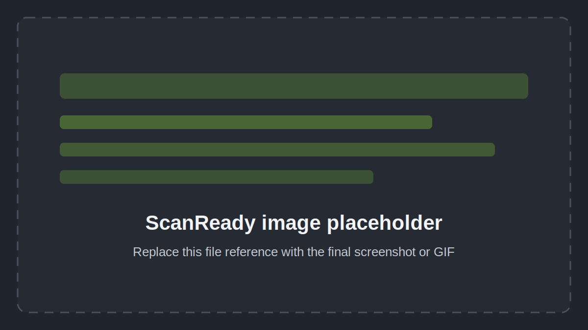

# Guida rapida

Questa pagina mostra il flusso piu semplice per usare ScanReady.

## Flusso veloce

1. Seleziona la mesh high poly o il parent della scansione.
2. Apri il tab **Scan Ready** nella sidebar.
3. Premi **One Click Bake**.
4. Aspetta la fine del processo.
5. Controlla la mesh finale e le texture generate.

## Flusso manuale

Se vuoi piu controllo:

1. In **Step 1**, scegli `Final Faces` e premi **Create Lowpoly Preview**.
2. In **Step 2**, controlla il cage e premi **Generate UVs**.
3. In **Step 3**, scegli le mappe da cuocere e premi **Bake Textures**.

## Workflow Status

Il box **Workflow Status** ti dice cosa fare dopo.

Esempi:

- `Press Create Lowpoly Preview`
- `Press Generate UVs`
- `Press Bake Textures`

Se cambi un parametro, ScanReady prova a consigliarti il prossimo passaggio corretto.

## Immagini da aggiungere

- GIF One Click Bake dall'inizio alla fine.
- Screenshot Workflow Status durante gli step.
- Screenshot della mesh finale selezionata.

