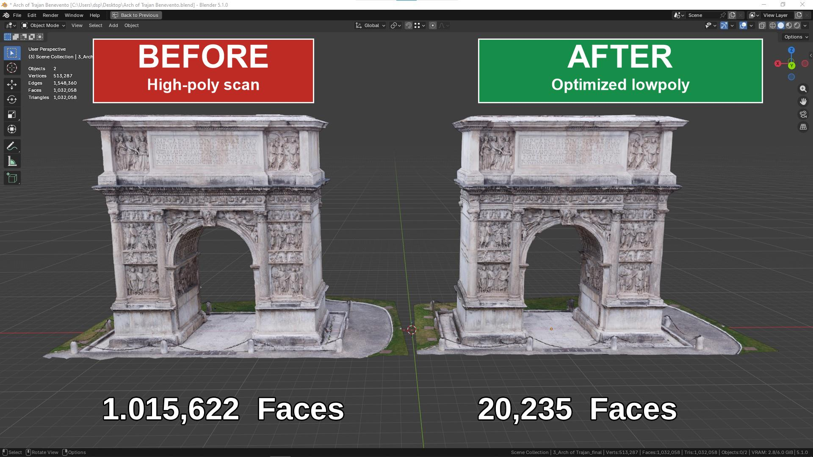
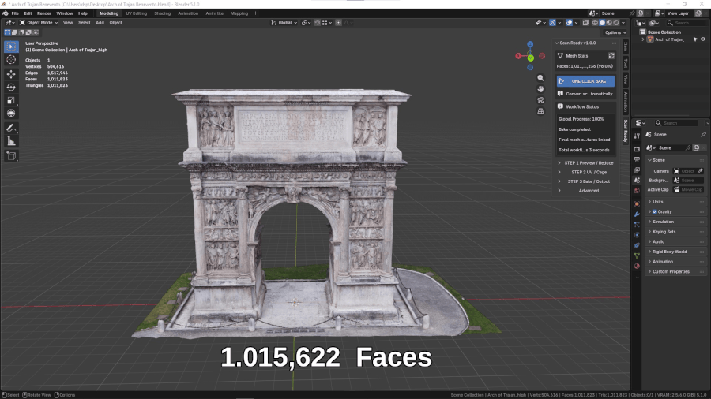

# ScanReady

Workflow di ottimizzazione adattiva e bake per scansioni in Blender

  

 

ScanReady è un addon per Blender pensato per trasformare scansioni 3D pesanti in asset ottimizzati e pronti per il realtime.

È pensato per artisti 3D, creatori di asset, workflow di fotogrammetria, VR, videogame, visualizzazione in tempo reale e scene interattive.

Invece di trattare tutta la mesh nello stesso modo, ScanReady usa un workflow di riduzione adattiva che aiuta a proteggere silhouette, bordi, cambi di forma e dettagli importanti, riducendo in modo più aggressivo le aree piatte o meno rilevanti.

  <b>Scansione high-poly -> Mesh ottimizzata -> UV -> Bake -> Asset realtime</b>

---

## Perché ScanReady è diverso

Molti workflow di ottimizzazione usano una semplice riduzione uniforme.

ScanReady invece usa **Adaptive Reduce** per distribuire la riduzione in modo più intelligente:

- Le aree piatte possono essere ridotte di più.
- I dettagli importanti vengono protetti meglio.
- Le silhouette e le transizioni di forma rimangono più leggibili.
- Le superfici rumorose della scansione possono essere semplificate senza perdere subito l'identità dell'oggetto.

  

  <b>Blender Decimate vs ScanReady Adaptive Reduce</b> 
  Stessa scansione, densità finale simile. ScanReady riduce in modo più aggressivo le zone piatte e protegge meglio dettagli, bordi e cambi di forma.

---

## Perché ScanReady?

Le scansioni 3D grezze possono essere molto pesanti:

- milioni di poligoni;
- molte texture ad altissima risoluzione;
- molti materiali;
- UV poco ottimizzate;
- materiali non pronti per il realtime;
- bake complessi da configurare manualmente;
- performance scarse in VR, videogame o scene interattive.

ScanReady aiuta a passare da una scansione pesante a un asset più leggero, pulendo la mesh da imperfezioni e preparando UV, materiali e texture bake per l'uso in produzione.

---

## Prima / Dopo

Ottimizzato per workflow in tempo reale senza sprecare poligoni inutilmente.

  

  <b>Da scansioni fotogrammetriche pesanti ad asset ottimizzati e pronti per VR, videogame, AR e visualizzazione in tempo reale.</b>

  

  <b>1M poligoni -> mesh game-ready ottimizzata da 20K</b>

---

## One Click Bake

Il workflow **ONE CLICK BAKE** esegue automaticamente i passaggi principali:

1. Pulizia della scansione selezionata.
2. Creazione di una preview low-poly ottimizzata.
3. Generazione delle UV.
4. Stima o preparazione del cage.
5. Bake delle texture.
6. Collegamento dei materiali finali.
7. Salvataggio delle immagini se **Save Images** è attivo.

È il percorso più veloce per ottenere una prima versione dell'asset.

---

## Funzioni principali

### Ottimizzazione adattiva

**Adaptive Reduce** riduce meglio le zone piatte e protegge dettagli, bordi e silhouette importanti.

### Workflow One Click

**ONE CLICK BAKE** esegue automaticamente pulizia, preview low-poly, UV, cage, bake e materiali finali.

### Workflow Smart UV

ScanReady usa **Smart UV Project** per generare UV automatiche sulla mesh ottimizzata.

### Generazione automatica del cage

**Auto Cage Extrusion** stima una distanza iniziale del cage confrontando la versione high-poly con la versione low-poly. In questo modo aiuta il cage a ricoprire i dettagli importanti da catturare durante il bake, rendendo il bake più pulito e più facile da configurare.

### Texture Baking

ScanReady supporta bake di **Base Color**, **Normal Map** e **Occlusion Map**. **Bake Roughness Map** compare quando il materiale sorgente contiene un input Roughness collegato.

### Supporto multi-materiale

**Bake Materials** permette di dividere il bake in più materiali quando una scansione grande richiede più spazio texture.

### Ottimizzazione realtime

Il workflow è pensato per asset più leggeri destinati a VR, videogame, AR e visualizzazione in tempo reale.

### Bake sicuro per la memoria

Le opzioni **Safe Memory Bake** e **Force CPU Baking** aiutano con scene pesanti e sistemi con VRAM limitata.

### Preset riutilizzabili

I preset permettono di salvare e riutilizzare setup di workflow per scansioni simili.

---

## Panoramica del workflow

ScanReady può essere usato in due modi:

- **One Click Bake**: workflow automatico completo.
- **Workflow manuale**: controllo separato di riduzione, UV, cage e bake.

Il workflow manuale è utile quando vuoi controllare meglio il risultato:

### 1. Preview / Reduce

   Crea una mesh ottimizzata dalla scansione high-poly. Con il valore predefinito **Optimize / Reduce 0.10**, la preview viene ridotta di circa il 90%.

### 2. UV / Cage

   Genera UV e prepara il cage per il bake.

### 3. Bake / Output

   Esegue il bake delle texture e crea l'asset finale.

---

## Pensato per il realtime

ScanReady è pensato per preparare asset destinati a:

- VR e AR;
- videogame;
- realtime visualization;
- scene interattive;
- engine come Unreal Engine, Unity, S2 Engine, Godot o viewer realtime;
- ambienti dove poligoni, memoria e texture devono rimanere sotto controllo.

---

## Cosa crea ScanReady

Alla fine del workflow ScanReady può creare:

- un asset più leggero rispetto alla scansione originale; il numero di materiali e texture dipende dalle impostazioni scelte;
- una mesh finale ottimizzata;
- UV ottimizzate;
- materiali finali collegati alle texture;
- texture bake salvate su disco;

---

## Compatibilità

ScanReady è distribuito come **Blender Extension**.

Richiede **Blender 4.2 o successivo**. Consulta [Installazione](installation.md) per il pacchetto e la procedura di aggiornamento.

---

## Inizia da qui

Per iniziare:

- [Installazione](installation.md)
- [Guida rapida](quick-start.md)
- [One Click Bake](one-click.md)
- [Step 1 - Preview / Reduce](step1.md)
- [Step 2 - UV / Cage](step2.md)
- [Step 3 - Bake / Output](step3.md)

---

## Video e tutorial

Consulta la pagina [Video Tutorials](video-tutorials.md) per i tutorial in preparazione e il percorso consigliato.

[Canale YouTube Mario Schiano 3D](https://www.youtube.com/@marioschiano3d)

---

## Supporto

Per problemi, domande o feedback:

**Email:** <support.marioschiano3d@gmail.com>
