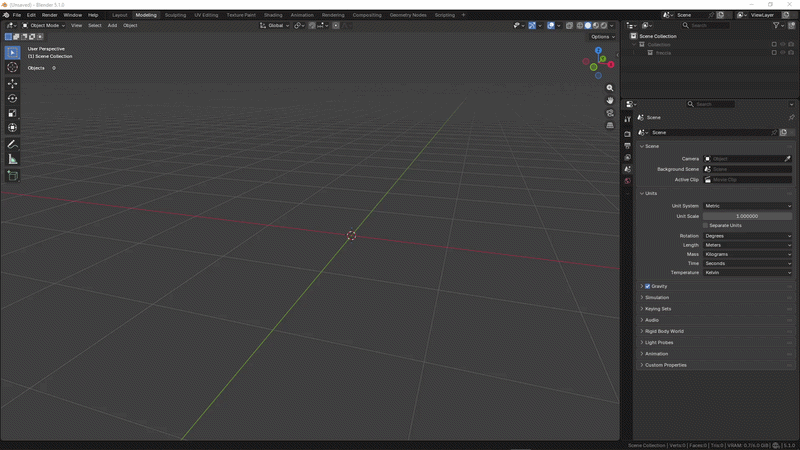

# Installazione

Questa pagina spiega come installare ScanReady 1.0 in Blender.

---

## Scarica l'addon

Scarica il file dell'estensione:

`scanready_v1_0_0.zip`

Non estrarre lo ZIP.

Blender installa le estensioni direttamente dal file `.zip`.

---

## Installa l'addon

1. Apri Blender.
2. Vai su **Edit > Preferences**.
3. Apri la sezione **Get Extensions** o **Add-ons**, in base alla versione di Blender.
4. Clicca **Install from Disk**.
5. Seleziona `scanready_v1_0_0.zip`.
6. Abilita **ScanReady**.

  

---

## Abilita l'addon

Dopo l'installazione, assicurati che ScanReady sia attivo.

Nelle preferenze di Blender dovresti vedere:

- **Name:** ScanReady
- **Type:** Extension
- **Version:** 1.0.0
- **Maintainer:** Mario Schiano

---

## Apri il pannello ScanReady

Nel 3D Viewport:

1. Premi `N` per aprire la sidebar.
2. Apri la scheda **Scan Ready**.
3. Seleziona una mesh high-poly.
4. Usa **ONE CLICK BAKE** oppure il workflow manuale.

---

## Aggiornamenti

Il pannello delle preferenze include link rapidi alla documentazione e alle release notes.

Il pulsante **Check for Updates** apre la pagina della documentazione di ScanReady, dove puoi controllare nuove versioni o note di rilascio.

---

## Se il pannello non appare

Controlla che:

- l'addon sia abilitato nelle preferenze;
- il file installato sia lo ZIP dell'estensione;
- Blender sia stato riavviato dopo l'installazione;
- stai guardando la sidebar del 3D Viewport, non un altro editor.

Per problemi di installazione:

**Email:** <softandsoft2025@gmail.com>
