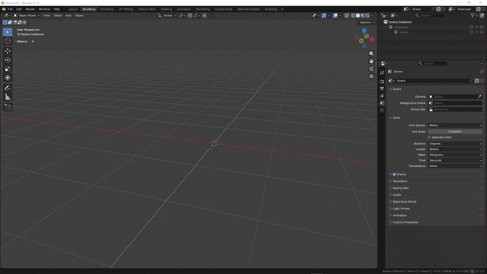

# Installazione

Questa pagina spiega come installare ScanReady in Blender.

---

## Scarica l'addon

Scarica il file dell'estensione:

`scanready_v1_0_0.zip`

Non estrarre lo ZIP.

Blender installa le estensioni direttamente dal file `.zip`.

---

## Installa l'addon

1. Apri Blender.
2. Vai su **Edit > Preferences**.
3. Apri la sezione **Get Extensions** o **Add-ons**, in base alla versione di Blender.
4. Clicca **Install from Disk**.
5. Seleziona `scanready_v1_0_0.zip`.
6. Abilita **ScanReady**.

  

---

## Abilita l'addon

Dopo l'installazione, assicurati che ScanReady sia attivo.

Nelle preferenze di Blender dovresti vedere:

- **Name:** ScanReady
- **Type:** Extension
- **Version:** 1.0.0 o successiva
- **Maintainer:** Mario Schiano

---

## Apri il pannello ScanReady

Nel 3D Viewport:

1. Premi `N` per aprire la sidebar.
2. Apri la scheda **Scan Ready**.
3. Seleziona una mesh high-poly.
4. Premi **ONE CLICK BAKE** oppure usa il workflow manuale.

---

## Aggiornamenti

Gli aggiornamenti ufficiali vengono installati tramite Blender Extensions / Superhive.

Se ScanReady è installato da un repository o marketplace collegato a Blender Extensions, Blender può mostrare il pulsante **Update** nella schermata Extensions quando è disponibile una versione più recente.

ScanReady include anche un controllo manuale in **Edit > Preferences > Add-ons > ScanReady**: **Check for Updates** legge il manifest pubblico della documentazione e può segnalare che esiste una versione più nuova. Questo controllo è informativo: non installa l'update e non sostituisce Blender Extensions / Superhive.

Nelle Preferences trovi anche link rapidi alla documentazione, alle release notes e ai tutorial.

---

## Se il pannello non appare

Controlla che:

- l'addon sia abilitato nelle preferenze;
- il file installato sia lo ZIP dell'estensione;
- Blender sia stato riavviato dopo l'installazione;
- stai guardando la sidebar del 3D Viewport, non un altro editor.

Consulta anche le pagine **FAQ** e **Risoluzione problemi** per trovare le soluzioni più comuni.

Per problemi di installazione:

**Email:** <support.marioschiano3d@gmail.com>
