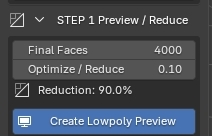
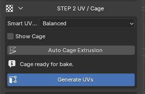
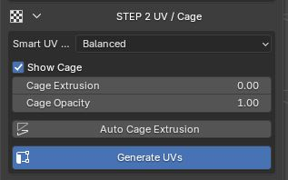
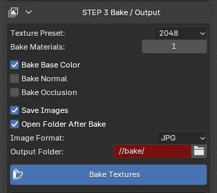

# Guida manuale

Usa questa guida quando vuoi seguire ScanReady passo dopo passo, invece di usare **One Click Bake**.

Il workflow manuale ti permette di controllare separatamente riduzione, UV, cage e bake. È utile quando vuoi decidere con più precisione quanto ottimizzare la mesh, come generare le UV e quali texture creare.

---

## Step 1 - Crea la preview low-poly

  <ol>
    <li>Seleziona la scansione high-poly nel viewport di Blender.</li>
    <li>Apri <strong>STEP 1 Preview / Reduce</strong>.</li>
    <li>Regola <strong>Optimize / Reduce</strong> o <strong>Final Faces</strong> se vuoi una mesh più leggera o più dettagliata.</li>
    <li>Clicca <strong>Create Low-poly Preview</strong>.</li>
  </ol>

  
ScanReady pulisce la scansione, crea una copia ottimizzata e genera una preview low-poly non distruttiva. La scansione high-poly originale resta intatta e viene usata come sorgente per UV, cage e bake.

  
Quando la preview ti sembra corretta, passa a <strong>Step 2 - UV / Cage</strong>.

  

---

## Step 2 - Genera UV e controlla il cage

  <ol>
    <li>Parti dalla preview low-poly creata nello Step 1.</li>
    <li>Apri <strong>STEP 2 UV / Cage</strong>.</li>
    <li>Clicca <strong>Generate UVs</strong>.</li>
  </ol>

  
ScanReady crea un nuovo layout UV sulla mesh ottimizzata. Questo prepara l'asset per ricevere le texture bake sulla nuova superficie low-poly.

  
Dopo le UV, controlla il cage:

  <ul>
    <li>abilita <strong>Show Cage</strong>;</li>
    <li>verifica che il cage copra la superficie high-poly;</li>
    <li>usa <strong>Auto Cage Extrusion</strong> se vuoi una stima automatica;</li>
    <li>regola <strong>Cage Extrusion</strong> se devi correggere manualmente la distanza.</li>
  </ul>

  
Quando UV e cage sono pronti, passa a <strong>Step 3 - Bake / Output</strong>.

  
  

---

## Step 3 - Esegui il bake

  <ol>
    <li>Apri <strong>STEP 3 Bake / Output</strong>.</li>
    <li>Scegli <strong>Texture Preset / Texture Size</strong>.</li>
    <li>Imposta <strong>Bake Materials</strong>.</li>
    <li>Attiva le mappe che vuoi generare, per esempio <strong>Bake Base Color</strong>, <strong>Bake Normal</strong>, <strong>Bake Roughness</strong> o <strong>Bake Occlusion</strong>.</li>
    <li>Clicca <strong>Bake Textures</strong>.</li>
  </ol>

  
ScanReady esegue il bake una texture alla volta, collega le texture generate al materiale finale e crea un asset più leggero pronto per realtime, VR, videogame, AR e scene interattive.

  
Prima di cliccare <strong>Bake Textures</strong>, controlla che il cage copra la scansione high-poly. Se il cage è troppo piccolo, possono comparire aree nere, dettagli mancanti o proiezioni errate.

  

---

## Se vuoi ottimizzare di più

Puoi tornare indietro in qualsiasi momento.

Se sei già nello Step 2 o nello Step 3 e ti accorgi che la mesh è ancora troppo pesante, torna a **Step 1 - Preview / Reduce**, abbassa **Final Faces** o **Optimize / Reduce**, poi clicca di nuovo **Create Low-poly Preview**.

Dopo aver ricreato la preview, continua di nuovo in avanti:

1. torna a **Step 2 - UV / Cage**;
2. clicca di nuovo **Generate UVs**;
3. controlla il cage;
4. torna a **Step 3 - Bake / Output**;
5. clicca **Bake Textures**.

Il bake dovrebbe sempre usare la mesh UV ottimizzata più recente.

---

## Quando usare le pagine Step dettagliate

Questa pagina ti dice cosa premere e in quale ordine.

Per capire meglio ogni fase, usa le pagine dedicate:

- [Step 1 - Preview / Reduce](step1.md) per Adaptive Reduce, Optimize / Reduce, Final Faces e preview.
- [Step 2 - UV / Cage](step2.md) per Smart UV Project, checker, cage e Auto Cage Extrusion.
- [Step 3 - Bake / Output](step3.md) per texture size, bake materials, mappe bake, output e salvataggio immagini.
