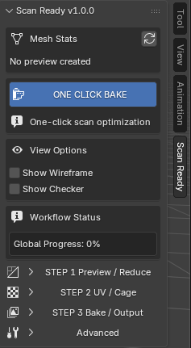

# Guida rapida

Questa pagina mostra il modo più veloce per usare ScanReady.

  

---

!!! note "Prima di iniziare"
    Salva una copia del file `.blend`. La riduzione avviene su una preview separata, ma le opzioni di preparazione possono modificare la sorgente high-poly.

## Workflow base

  

    
Per una prima prova veloce, lascia che ScanReady gestisca automaticamente il workflow con i valori predefiniti:

    <ol>
      <li>Seleziona la mesh high-poly della scansione.</li>
      <li>Clicca <strong>ONE CLICK BAKE</strong>.</li>
    </ol>

    
Con il valore predefinito <strong>Optimize / Reduce 0.10</strong>, ScanReady mantiene circa il 10% dei poligoni, cioè riduce automaticamente la mesh di circa il 90%, genera le UV e completa il bake con le impostazioni predefinite.

  

  

    
<strong>ONE CLICK BAKE</strong>

    
  

---

## Cosa succede automaticamente

Quando usi **ONE CLICK BAKE**, ScanReady esegue il workflow principale:

1. Pulisce la scansione selezionata.
2. Crea una preview low-poly ottimizzata.
3. Genera le UV.
4. Prepara il cage.
5. Esegue il bake delle texture selezionate.
6. Crea il materiale finale.
7. Salva le immagini se **Save Images** è attivo, come da impostazione predefinita.

Il modello viene quindi ottimizzato, riceve nuove UV e può ottenere il bake delle texture selezionate in un unico workflow.

  

---

## Valori predefiniti

Per la prima prova non è necessario cambiare le impostazioni. Se non hai modificato i valori predefiniti, ScanReady parte da:

- **Optimize / Reduce:** `0.10`
- **Final Faces:** valore collegato al rapporto di riduzione
- **Adaptive Reduce:** attivo
- **Adaptive Preset:** `Balanced`
- **Texture Size:** `2048`
- **Bake Base Color:** attivo
- **Bake Normal Map:** attivo secondo le impostazioni predefinite
- **Save Images:** attivo per salvare le texture su disco

Questi valori servono solo per capire da dove parte il workflow automatico. Per la prima prova puoi lasciare tutto invariato e premere direttamente **ONE CLICK BAKE**.

---

## Risultato rapido

Dopo il bake dovresti ottenere:

- una mesh finale più leggera;
- UV generate automaticamente;
- texture bake collegate al materiale;
- file immagine salvati nella cartella di output, se abilitato.

Controlla il risultato nel viewport e nella sezione **Step 3 - Bake / Output**.

!!! tip "Puoi rifinire anche dopo One Click Bake"
    Se il risultato non è sufficiente, torna agli step manuali e modifica le impostazioni solo dove serve. Se il modello finale risulta ancora troppo pesante, oppure se è stato ottimizzato troppo e perde dettagli importanti della forma, torna a **Step 1 - Preview / Reduce**.

    Regola **Optimize / Reduce** o **Final Faces** e osserva l'aggiornamento della preview. Quando il risultato ti convince, passa allo Step 2 e clicca di nuovo **Generate UVs**.

    Il workflow è flessibile: anche se sei già in **Step 2 - UV / Cage** oppure **Step 3 - Bake / Output**, puoi tornare allo Step 1, regolare la riduzione dei poligoni e poi proseguire di nuovo verso UV e bake.

---

## Quando usare gli step manuali

Usa il workflow manuale se vuoi più controllo:

- [Step 1 - Preview / Reduce](step1.md) per regolare la densità della mesh.
- [Step 2 - UV / Cage](step2.md) per controllare UV e cage.
- [Step 3 - Bake / Output](step3.md) per gestire texture, materiali e output.
