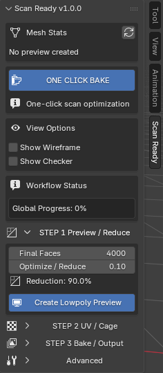
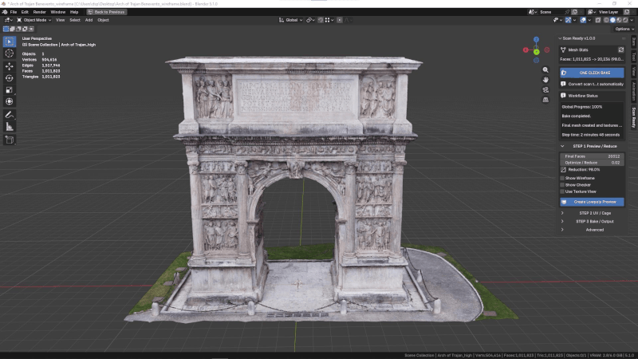
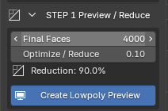
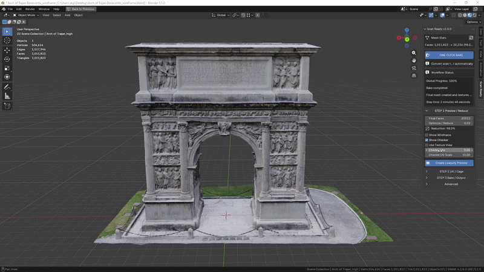
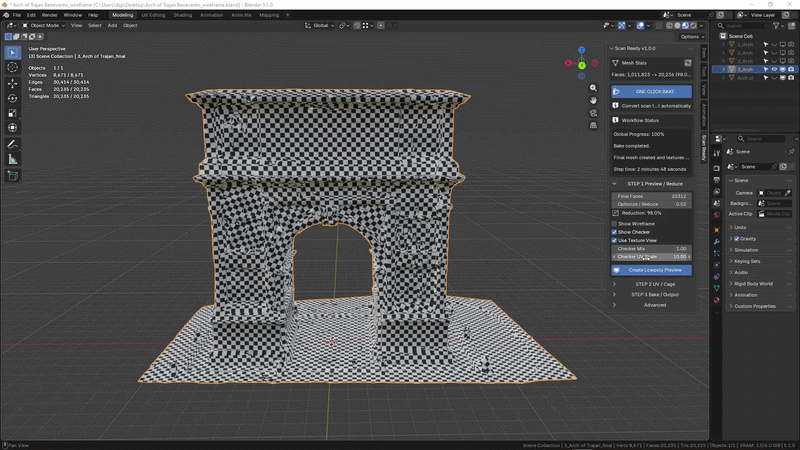
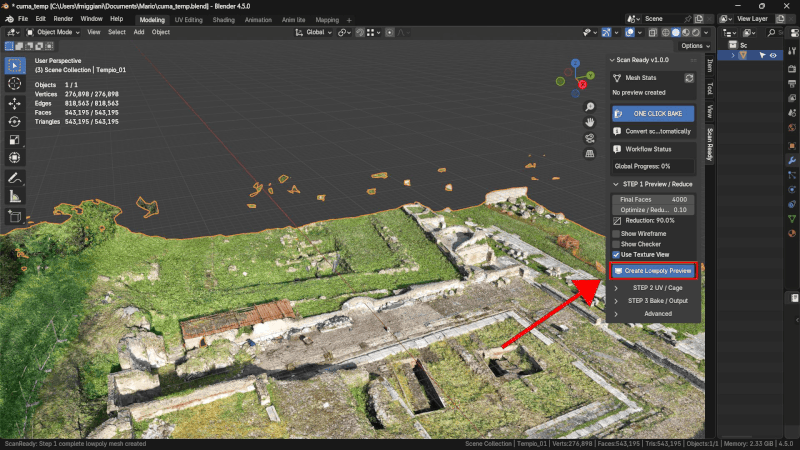

# Step 1 - Preview / Reduce

Step 1 crea una preview lowpoly della scansione.

  

## Obiettivo

Ridurre la mesh originale mantenendo una buona leggibilita delle forme.

## Controlli principali

### Final Faces

Numero indicativo di facce desiderate per la preview lowpoly.

Valori piu bassi rendono la mesh piu leggera. Valori piu alti conservano piu dettaglio.

### Optimize / Reduce

Controlla la percentuale di riduzione.

Esempio: `0.10` mantiene circa il 10% della geometria.

### Create Lowpoly Preview

Crea o aggiorna la mesh lowpoly preview.

Se non hai cambiato parametri importanti, ScanReady puo avvisarti che la preview e gia aggiornata.

  

## Adaptive Reduce

Adaptive Reduce protegge le zone con piu dettaglio e riduce di piu le aree piatte.

Preset disponibili:

- **Balanced**
- **Preserve Details**
- **Flat Surfaces**

### Show Adaptive Weights

Mostra i pesi sulla preview:

- rosso: aree piatte ridotte di piu;
- blu/verde: dettaglio protetto.

  

  

  

  

  

  

  

## Quando rifare Step 1

Rifai **Create Lowpoly Preview** se cambi:

- Final Faces;
- Optimize / Reduce;
- Adaptive Preset;
- valori manuali di Adaptive Reduce;
- opzioni di pulizia mesh in Advanced.

## Immagini/GIF da aggiungere

- GIF riduzione mesh.
- Screenshot Show Adaptive Weights.
- GIF wireframe prima/dopo.
- Screenshot Workflow Status che consiglia Step 1.

