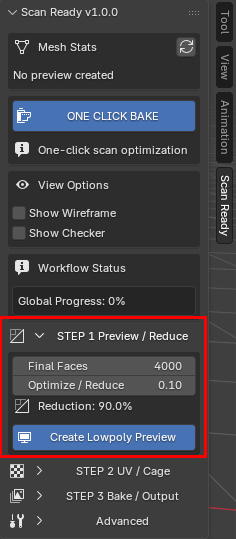

# Step 1 - Preview / Reduce

Crea una preview ottimizzata e leggera dalla scansione high-poly.

Il tempo di elaborazione dipende dalla densità della scansione e dalla potenza del computer: una scansione con milioni di poligoni può richiedere anche circa un minuto o più su un PC di media potenza.

  

Optimize / Reduce controlla quanta geometria viene mantenuta nella preview low-poly. Il valore predefinito 0.10 crea una preview con circa 90% di poligoni in meno.

---

## Ottimizzazione adattiva

L'ottimizzazione non viene applicata in modo uniforme su tutto il modello.

ScanReady preserva il dettaglio importante della superficie mentre semplifica in modo più aggressivo le regioni piatte o meno dettagliate.

Questo aiuta a creare asset low-poly più puliti ed efficienti per workflow realtime.

### Adaptive Reduce

Adaptive Reduce è attivo di default e aiuta ScanReady a distribuire la riduzione dei poligoni in modo più intelligente sulla scansione.

Invece di trattare ogni superficie allo stesso modo, permette alle aree piatte di essere ridotte di più e protegge le regioni dove il dettaglio della superficie è più importante.

Questa è la differenza principale tra un semplice passaggio Blender Decimate e il workflow ScanReady. Una decimazione standard può ridurre bordi utili e regioni piatte rumorose con la stessa priorità. ScanReady crea prima pesi adattivi, poi li usa per ridurre le superfici ampie in modo più aggressivo mantenendo più protetti cambi di normale forti, silhouette, bordi e transizioni importanti della forma.

Usa il preset Adaptive Reduce come punto di partenza rapido:

- **Balanced** per la maggior parte delle scansioni e degli asset realtime generici.
- **Preserve Details** quando la scansione contiene pieghe importanti, forme scultoree, incisioni o dettagli ravvicinati.
- **Flat Surfaces** quando l'oggetto contiene ampie aree semplici che possono essere semplificate in modo più aggressivo.
- **Hard Surface** per veicoli e scansioni hard-surface, dove un passaggio approssimato più veloce deve proteggere soprattutto i cambi di normale più forti.

<!-- Sostituire il placeholder con ../../img/step1-adaptive-reduce.gif -->

  

<!-- Sostituire il placeholder con ../../img/step1-blender-decimate-vs-scanready.jpg -->

  

  <b>Blender Decimate vs ScanReady Adaptive Reduce</b> 
  Qui andrà un render comparativo reale in Blender: stessa scansione, densità finale simile, Decimate standard da un lato e ScanReady Adaptive Reduce dall'altro.

## Miglioramento performance

Le scansioni pesanti possono diventare rapidamente difficili da gestire dentro Blender.

### Esempio

- Scansione originale -> 1M+ poligoni
- Preview ottimizzata -> 20K poligoni

Questo aiuta a migliorare la risposta del viewport e rende l'asset più facile da elaborare nei workflow realtime.

---

## Workflow non distruttivo

ScanReady non modifica mai la scansione high-poly originale.

Una mesh ottimizzata duplicata viene generata automaticamente per il workflow, mantenendo intatta la scansione originale.

---

## Perché la riduzione è importante

Le scansioni high-poly sono spesso troppo pesanti per l'uso diretto.

Possono causare:

- performance lente nel viewport;
- scene Blender pesanti;
- esportazioni difficili;
- performance realtime scarse;
- asset VR troppo densi per essere visualizzati fluidamente;
- oggetti game troppo pesanti e difficili da gestire in produzione.

Preview / Reduce crea una versione più leggera della scansione prima di continuare con UV e bake.

Aiuta anche a rimuovere piccoli artefatti mesh generati da fotogrammetria o acquisizione 3D, come poligoni staccati, vertici isolati e frammenti sospesi.

---

Step 1 crea una preview low-poly ottimizzata dalla scansione high-poly selezionata.

Questo è il primo passaggio importante quando prepari un oggetto scansionato per **VR, AR, videogame, visualizzazione realtime o scene interattive**.

ScanReady prima pulisce i frammenti indesiderati comuni della scansione, poi riduce il modello preservando la forma generale e l'identità visiva della scansione originale.

---

<h3>Optimize / Reduce</h3>

Il valore predefinito e <strong>0.10</strong>.

Mantiene circa <strong>10% dei poligoni originali</strong>, creando una preview low-poly più leggera con circa <strong>90% di poligoni in meno</strong>.

Dopo aver cliccato <strong>Create Low-poly Preview</strong>, puoi ancora regolare questo valore per provare risultati più leggeri o più dettagliati.

Scansioni molto dense con milioni di poligoni possono comunque richiedere tempo di elaborazione.

Gli aggiornamenti realtime dipendono dalla complessità della scansione e dalle performance di Blender.

  

---

## Impostazioni principali

<h3>Final Faces</h3>

Imposta il numero target di facce per la mesh low-poly ottimizzata.

Usa valori più bassi per asset VR o game leggeri.

Usa valori più alti quando l'oggetto deve conservare più dettaglio nella silhouette.

<h3>Optimize / Reduce</h3>

Controlla quanto ScanReady riduce la scansione high-poly selezionata.

Il valore predefinito e <strong>0.10</strong>, che mantiene circa <strong>10% dei poligoni originali</strong>.

Valori più bassi generano asset più leggeri.

Valori più alti preservano più dettaglio della forma.

<h3>Reduction</h3>

Mostra la percentuale di riduzione corrente in base alle impostazioni di ottimizzazione selezionate.

  

---

## View Options

Nel pannello attuale di ScanReady, **Show Wireframe** e **Show Checker** si trovano prima dello **STEP 1**.

Sono strumenti di preview usati per controllare topologia e leggibilità UV senza cambiare il workflow di bake.

  
  

---

## Show Wireframe

Mostra la topologia dell'oggetto preview.

Usalo per controllare se la mesh è ancora troppo densa o se è stata ridotta troppo aggressivamente.

  

---

## Show Checker

Mostra una texture checker sulla mesh preview.

Aiuta a controllare densità UV e distorsione texture.

  

---

## Checker Mix / Checker UV Scale

<h3>Checker Mix</h3>

Controlla quanto forte appare l'overlay checker sulla superficie del modello.

<h3>Checker UV Scale</h3>

Cambia la dimensione dei quadrati checker.

Quadrati più piccoli rendono più facile vedere stretching e distorsione UV.

Quadrati più grandi sono utili per controlli generali rapidi.

  

  

Checker Mix regola quanto è visibile l'overlay checker sopra la superficie del modello.

  

Checker UV Scale cambia la dimensione del pattern checker per rendere più facile controllare lo stretching UV.

---

## Quando rifare la preview

Usa di nuovo **Create Low-poly Preview** quando cambi densità o vuoi testare una riduzione diversa.

Se la preview è troppo pesante o troppo semplificata, regola **Optimize / Reduce** o **Final Faces** e crea di nuovo la preview.

Puoi tornare allo Step 1 in qualsiasi momento. Se sei già nello Step 2 o nello Step 3 e decidi che il modello deve essere più leggero o più dettagliato, cambia qui le impostazioni di riduzione, clicca di nuovo **Create Low-poly Preview**, poi continua generando UV e bake di nuovo.

ScanReady pulisce la scansione high-poly selezionata, rimuove rumore mesh comune come poligoni staccati o vertici isolati, poi crea un oggetto preview ottimizzato.

Prima che venga aggiunto il modificatore Decimate, ScanReady può eseguire anche una pulizia **Pre-Decimate Merge** sulla mesh preview duplicata.
Questo aiuta a ridurre poligoni sovrapposti della scansione prima dell'ottimizzazione.

  

Quando la preview è corretta, continua con:

[Step 2 - UV / Cage](step2.md)

---

## Cosa controllare

Dopo aver creato la preview, controlla:

- silhouette generale;
- bordi importanti e dettagli della forma;
- densità dei poligoni;
- leggibilità del wireframe;
- se la scansione è abbastanza leggera per la piattaforma target;
- se è stata persa troppa informazione visiva.

Se la preview è troppo pesante, riducila di più.

Se la preview perde dettagli importanti della forma, aumenta la densità target e creala di nuovo.

---

## Obiettivi di ottimizzazione realtime

Per workflow VR e videogame, l'obiettivo non è solo la qualità visiva.

L'asset deve restare abbastanza leggero per performance realtime fluide.

Una buona preview dovrebbe:

- preservare la forma riconoscibile della scansione originale;
- rimuovere densità inutile della scansione;
- migliorare la risposta del viewport di Blender;
- essere adatta alla generazione UV;
- essere pronta per il texture bake nello step successivo.
