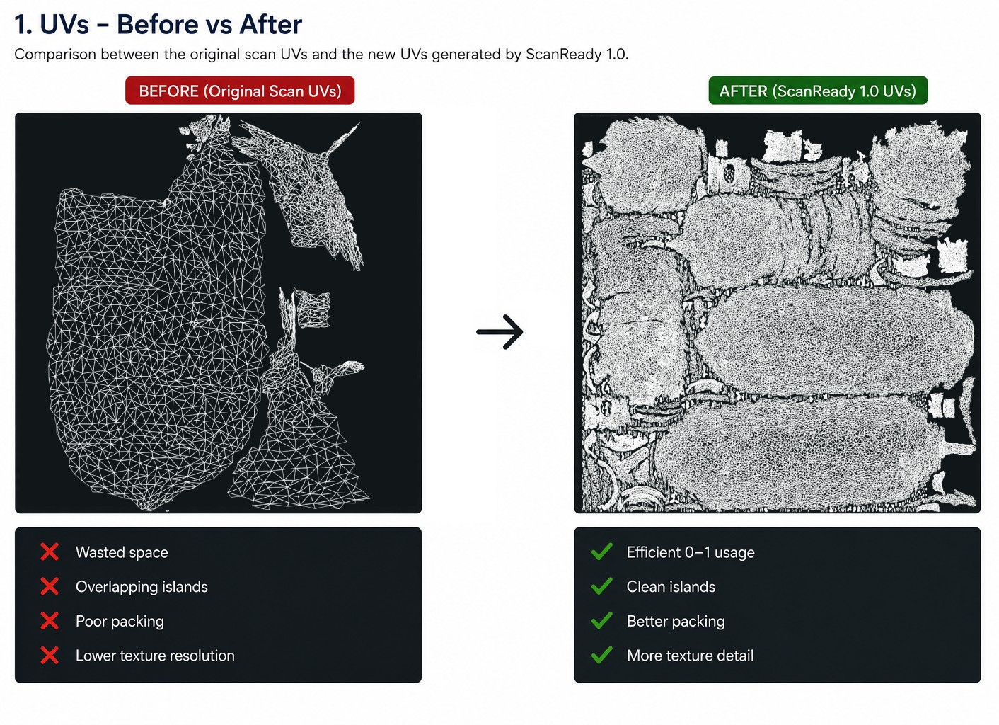
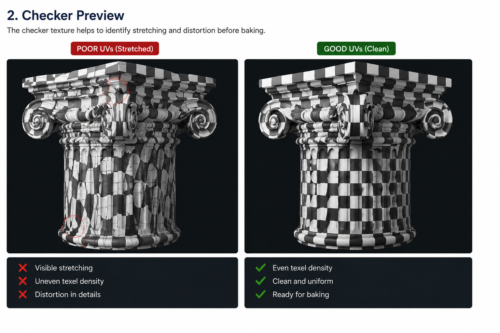
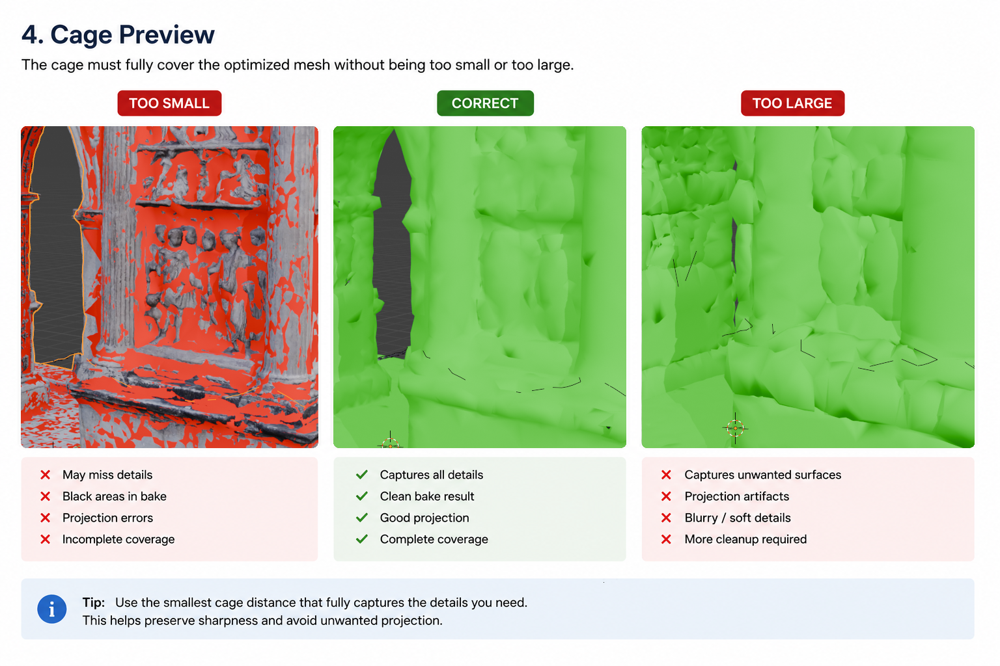

# Step 2 - UV / Cage

  

<b>UV della scansione originale vs packing UV ottimizzato generato da ScanReady.</b>

---

Step 2 genera un nuovo layout UV e prepara il cage per il bake.

Dopo che la scansione e stata semplificata nello Step 1, la mesh ottimizzata ha bisogno di UV pulite per ricevere correttamente le texture sulla nuova superficie lowpoly.

Questo step prepara l'asset al trasferimento delle texture, permettendo alla mesh ottimizzata di mantenere gran parte della ricchezza visiva della scansione high-poly originale, restando abbastanza leggera per **VR, videogame, AR, visualizzazione realtime e ambienti interattivi**.

---

## Perche servono le UV

Una mesh semplificata e piu leggera e piu facile da gestire, ma ha comunque bisogno di coordinate texture coerenti.

Le UV definiscono come la superficie del modello 3D viene aperta nello spazio texture 2D.

Dopo la riduzione, le UV originali della scansione non dovrebbero piu essere considerate affidabili sulla mesh ottimizzata.

Poiche la geometria e stata unita e semplificata, il layout UV originale puo diventare:

- stirato;
- distorto;
- sovrapposto;
- sporco;
- non allineato alla nuova superficie lowpoly.

Senza UV nuove, ScanReady non puo trasferire correttamente le informazioni texture dalla scansione originale alla mesh ottimizzata.

Creare UV nuove garantisce bake piu puliti e una proiezione texture piu affidabile.

  

<b>La preview checker aiuta a vedere stretching, densita texel irregolare e distorsioni UV prima del bake.</b>

---

## Migliore uso dello spazio UV

Le nuove UV migliorano anche l'efficienza dello spazio texture.

Molte scansioni fotogrammetriche contengono layout UV che sprecano grandi porzioni dello spazio texture 0-1.

Dopo l'ottimizzazione, ScanReady puo generare un layout UV piu pulito, con packing migliore e uso piu efficiente delle texture.

<!-- Sostituire il placeholder con ../../img/step2-uv-packing.png -->

  

Questo permette all'asset ottimizzato di conservare piu dettaglio usando meno materiali e meno memoria texture.

UV buone aiutano a ottenere:

- texture bake piu pulite;
- migliore nitidezza delle texture;
- meno seam visibili;
- migliori performance realtime;
- risultati piu affidabili nei game engine.

---

## Le texture sostituiscono la geometria

L'obiettivo del bake e conservare la ricchezza visiva della scansione originale riducendo la densita dei poligoni.

Invece di mantenere milioni di poligoni, ScanReady trasferisce le informazioni visive della superficie nelle texture.

Questo permette alla mesh ottimizzata di restare leggera pur conservando gran parte dell'aspetto originale.

---

## Perche serve il cage

Il cage controlla come Blender proietta i dettagli dalla scansione high-poly alla mesh ottimizzata durante il bake.

Se il cage e troppo piccolo:

- alcuni dettagli possono non essere catturati;
- possono comparire aree nere;
- possono apparire errori di proiezione.

Se il cage e troppo grande:

- il bake puo catturare superfici vicine indesiderate;
- possono apparire artefatti di proiezione.

ScanReady include strumenti per rendere questo processo piu veloce e piu semplice.

  

<b>Se il cage appare rosso, il bake non proiettera correttamente. Abilita Show Cage, poi aumenta leggermente Cage Extrusion oppure usa Auto Cage Extrusion prima di continuare.</b>

  

<b>Cage troppo piccoli perdono dettagli. Cage troppo grandi possono catturare superfici vicine indesiderate.</b>

  

<b>La dimensione del cage influenza direttamente il bake: un cage corretto cattura i dettagli in modo pulito senza proiettare geometria indesiderata.</b>

---

## Metodo UV

ScanReady usa **Smart UV Project** per generare UV sulla mesh ottimizzata.

Smart UV Project e il metodo automatico di unwrap UV di Blender.

E utile per gli oggetti scansionati perche puo generare rapidamente isole UV senza richiedere seam manuali.

ScanReady espone i controlli Smart UV cosi puoi regolare il comportamento dell'unwrap prima del bake.

  

---

## Impostazioni UV

Queste impostazioni controllano come Smart UV Project apre la mesh ottimizzata.

<!-- Sostituire il placeholder con ../../img/step2-ui-panel.png -->

  

<h3>Smart UV Preset</h3>

ScanReady usa Blender Smart UV Project per la generazione UV automatica.

I preset Smart UV disponibili includono <strong>Detailed</strong>, <strong>Balanced</strong>, <strong>Large Islands</strong> e <strong>Continuous</strong>.

I controlli UV influenzano come la mesh ottimizzata viene aperta prima del bake. Sono separati da Adaptive Reduce, che controlla come la mesh viene semplificata nello Step 1.

Cambiare Smart UV Preset, Smart UV Angle, UV Padding o Auto Pack UV non ricostruisce subito il layout UV corrente. Le nuove impostazioni UV vengono usate la prossima volta che clicchi <strong>Generate UVs</strong>, oppure quando <strong>One Click Bake</strong> esegue lo step di generazione UV. <strong>Bake Textures</strong> usa il layout UV gia esistente.

<h3>Smart UV Angle</h3>

Controlla quanto aggressivamente Smart UV Project divide la mesh in isole.

Valori piu bassi creano piu tagli e piu isole UV.

Valori piu alti creano isole UV piu grandi.

<h3>UV Padding</h3>

Imposta lo spazio tra le isole UV.

Aumenta il padding per ridurre il texture bleeding, soprattutto a risoluzioni texture piu basse.

<h3>Auto Pack UV</h3>

Impacchetta automaticamente le isole UV dopo l'unwrap.

Lascialo attivo a meno che tu voglia sistemare manualmente le isole UV.

Un packing UV migliore aiuta a sfruttare al massimo la risoluzione texture e a conservare piu dettaglio.

  <!-- Sostituire il placeholder con ../../img/step2-uv-settings.png -->
  

---

## Preview Checker

Usa **Show Checker** per controllare lo stretching UV prima del bake.

La checker texture aiuta a vedere:

- stretching UV;
- distorsione;
- densita texel irregolare;
- isole UV problematiche.

Un pattern checker pulito di solito indica un layout UV piu sano per il bake.

<!-- Sostituire il placeholder con ../../img/step2-checker-preview.png -->

  

---

## Controlli Cage

<h3>Show Cage</h3>

Mostra la preview del cage.

Usalo prima del bake per controllare che il cage circondi completamente la mesh ottimizzata.

<h3>Auto Cage Extrusion</h3>

Stima automaticamente la cage extrusion campionando la distanza tra la mesh ottimizzata e la scansione high-poly originale.

E utile per generare un punto di partenza rapido senza indovinare manualmente la distanza del cage.

<h3>Cage Extrusion</h3>

Controlla manualmente la distanza del cage.

Aumentala se il bake perde dettagli, crea aree nere o produce errori di proiezione.

Usa il valore piu piccolo che copre correttamente la superficie della scansione.

<!-- Sostituire il placeholder con ../../img/step2-cage-extrusion.png -->

  

<h3>Cage Alpha</h3>

Controlla l'opacita della preview del cage.

Influenza solo la visualizzazione nel viewport e non cambia il risultato del bake.

  <!-- Sostituire il placeholder con ../../img/step2-cage-settings.png -->
  

---

## Azione

Clicca **Generate UVs** dopo aver creato la preview lowpoly.

Se cambi **Smart UV Preset**, **Smart UV Angle**, **UV Padding** o **Auto Pack UV** dopo aver gia generato le UV, clicca di nuovo **Generate UVs** per applicare le nuove impostazioni UV. **Bake Textures** usa il layout UV esistente al momento del bake.

Se sei nello Step 2 e decidi che la mesh ottimizzata e ancora troppo pesante, torna a **Step 1 - Preview / Reduce**. Abbassa **Final Faces** o **Optimize / Reduce**, clicca di nuovo **Create Lowpoly Preview**, poi torna allo Step 2 e clicca di nuovo **Generate UVs** in modo che la mesh UV corrisponda alla nuova ottimizzazione.

Poi controlla:

- layout UV;
- preview checker;
- copertura del cage;

prima di continuare con:

[Step 3 - Bake / Output](step3.md)

---

## Cosa controllare

Prima del bake, verifica che:

- le UV siano generate sulla mesh ottimizzata;
- le isole UV siano impacchettate correttamente;
- il pattern checker non mostri stretching estremo;
- le isole UV abbiano abbastanza padding;
- il cage copra completamente le aree che devono ricevere dettaglio bake;
- il cage non sia cosi grande da catturare superfici vicine indesiderate.

---

## Ottimizzazione realtime

Per workflow VR e videogame, UV e bake permettono a un modello leggero di apparire comunque molto dettagliato.

La mesh ottimizzata dovrebbe conservare le informazioni visive importanti tramite texture, invece che tramite milioni di poligoni.

UV buone e un cage configurato correttamente aiutano a mantenere l'asset:

- piu leggero;
- piu facile da renderizzare;
- piu facile da esportare;
- piu affidabile nei motori realtime;
- visivamente piu vicino alla scansione originale.
