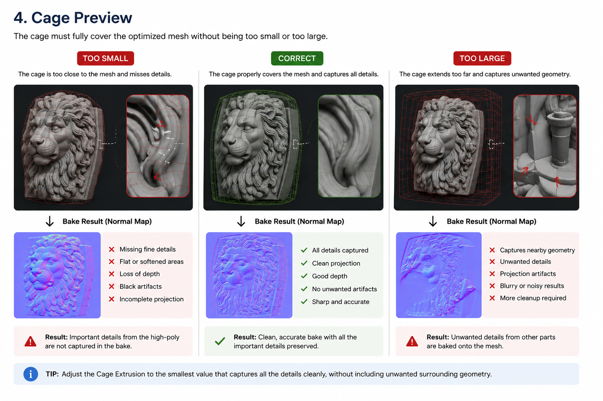

# Step 2 - UV / Cage

Step 2 genera le UV e prepara il cage per il bake.

  

## Obiettivo

Creare una mesh UV pronta per ricevere le texture dalla mesh high poly.

## Smart UV Preset

Il preset Smart UV cambia il comportamento di Smart UV Project.

Se la mesh UV non esiste ancora, dopo aver cambiato il preset ScanReady ti dira:

`Press Generate UVs.`

Se invece la mesh UV esiste gia, il Workflow Status puo consigliarti:

`Press Bake Textures.`

Questo succede perche il bake puo rigenerare automaticamente le UV quando serve.

  

## Cage

Il cage serve a catturare i dettagli della mesh high poly durante il bake.

  

### Cage Extrusion

Aumenta la distanza del cage.

Il valore parte da `0`, ma dopo che viene calcolato o regolato non deve essere azzerato solo perche cambi un preset UV.

### Auto Cage Extrusion

Calcola automaticamente una distanza iniziale per il cage.

### Show Cage

Mostra o nasconde il cage in viewport.

## Regola importante

Il cage deve diventare verde.

Se il cage e rosso o non copre bene la high poly, usa **Cage Extrusion** o **Auto Cage Extrusion**.

  

  

## Immagini/GIF da aggiungere

- GIF cage rosso che diventa verde.
- Screenshot Smart UV Preset.
- Screenshot Auto Cage Extrusion.
- Screenshot Workflow Status dopo cambio UV.

