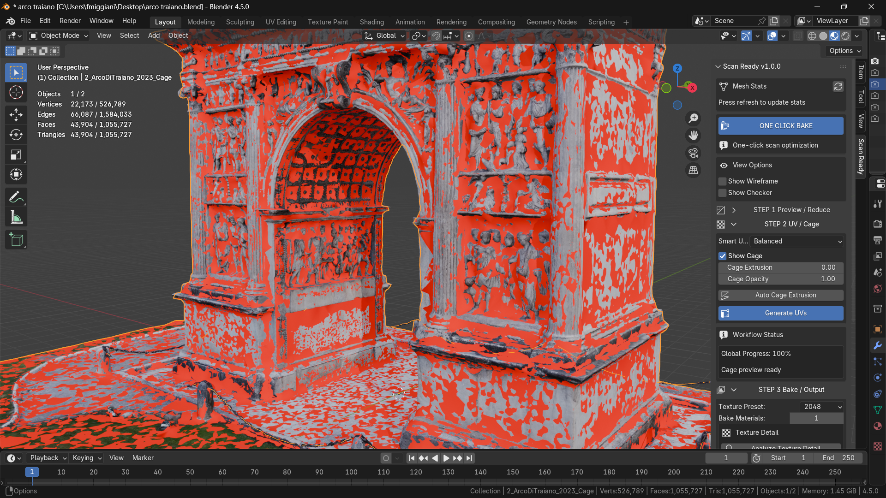

# Risoluzione problemi

Questa pagina raccoglie problemi comuni e controlli rapidi.

  

## Il bake ha zone nere

Possibili cause:

- cage troppo basso;
- high poly non coperta correttamente;
- materiali sorgente complessi;
- normali invertite;
- UV o margine insufficienti.

Prova:

1. usa **Auto Cage Extrusion**;
2. aumenta leggermente **Cage Extrusion**;
3. controlla che il cage diventi verde;
4. prova **Auto Fix Normals** in Advanced.

## Il cage non copre bene la mesh

Usa **Cage Extrusion** o **Auto Cage Extrusion**.

Se la scansione e molto sottile o sovrapposta, potrebbe servire una regolazione manuale.

## La mesh finale non si aggiorna

Controlla il **Workflow Status**.

Se dice:

- `Press Create Lowpoly Preview`, rifai Step 1;
- `Press Generate UVs`, rifai Step 2;
- `Press Bake Textures`, rifai il bake.

## Il bake sembra rifare troppo lavoro

ScanReady usa una cache per evitare passaggi inutili. Se hai cambiato risoluzione, mappe, UV, materiali o parametri cage, il bake deve aggiornarsi.

## Blender chiede di salvare texture originali

Non dovrebbe succedere. Le texture originali devono rimanere protette e non essere usate come target del bake.

## Immagini da aggiungere

- screenshot bake con zone nere;
- screenshot cage rosso/verde;
- screenshot Workflow Status con messaggio corretto;
- screenshot texture output corrette.

