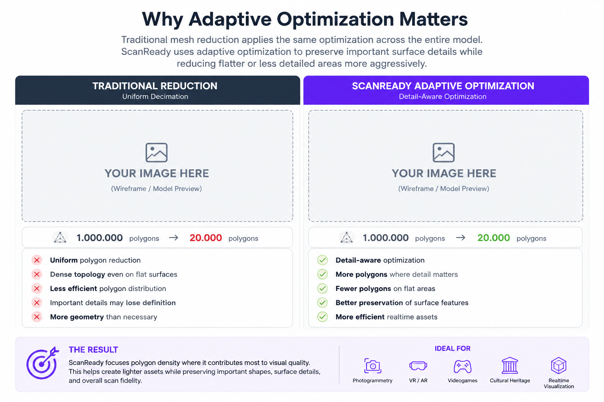

## Perché ScanReady?

Le scansioni fotogrammetriche sono dettagliate, ma spesso troppo pesanti per VR, videogame, viewer realtime e progetti interattivi.

ScanReady ti aiuta a trasformare quelle scansioni in asset ottimizzati e baked direttamente dentro Blender.

  

## Cosa risolve ScanReady

- Numero di poligoni elevato.
- Topologia della scansione non ottimizzata.
- Mancanza di una lowpoly pronta per UV.
- Setup manuale del cage.
- Preparazione bake ripetitiva.
- Workflow lento da scansione ad asset realtime.

  

---

## Ottimizzazione adattiva intelligente

La riduzione mesh tradizionale spesso applica la stessa ottimizzazione in modo uniforme su tutto il modello.

Questo può preservare inutilmente geometria densa nelle aree piatte mentre danneggia dettagli importanti nelle regioni più complesse.

ScanReady usa ottimizzazione adattiva per analizzare la superficie e preservare dettagli visivamente importanti, semplificando in modo più aggressivo le aree piatte o meno dettagliate.

Il risultato è un asset lowpoly più pulito ed efficiente, che mantiene molta più qualità della scansione originale dove conta davvero.

---

## Pensato per fotogrammetria e asset game-ready

ScanReady è progettato per convertire scansioni high-poly dense in asset ottimizzati e game-ready direttamente dentro Blender.

Invece di passare ore a pulire mesh manualmente, generare UV, creare cage e cuocere texture, ScanReady automatizza il workflow in una pipeline più veloce ed efficiente.

---

## Migliore uso dello spazio texture

ScanReady non ottimizza solo la densità dei poligoni.

L'addon aiuta anche a migliorare l'efficienza dello spazio UV e la preparazione del bake, per texture realtime più pulite e dettagliate.

Un packing UV ottimizzato aiuta a preservare dettaglio texture riducendo sprechi inutili.

---

## Il problema dei workflow tradizionali

Le scansioni fotogrammetriche sono spesso:

- estremamente pesanti;
- difficili da ottimizzare;
- difficili da aprire correttamente in UV;
- lente da cuocere;
- instabili su sistemi con poca VRAM.

Una singola scansione può contenere facilmente milioni di poligoni, rendendo l'ottimizzazione manuale lenta e frustrante.

---

## Cosa risolve ScanReady

**Ottimizzazione mesh**

Riduce automaticamente geometria densa preservando forme e dettagli importanti.

**Workflow Smart UV**

Genera UV pulite ottimizzate per bake e uso texture.

**Generazione automatica del cage**

Non serve creare manualmente cage per il bake.

**Bake multi-materiale**

Supporta asset di scansione complessi con più materiali.

**Bake sicuro per la memoria**

Progettato per lavorare in modo più sicuro anche su sistemi con VRAM limitata.

**Workflow One Click**

Da scansione ad asset game-ready con setup minimo.

---

## Pensato per artisti Blender

ScanReady lavora direttamente dentro Blender e si integra nei workflow esistenti senza software esterni.

Perfetto per:

- artisti di fotogrammetria;
- environment artist;
- game developer;
- creatori di asset;
- workflow VR e AR;
- applicazioni realtime.

---

## Da milioni di poligoni ad asset realtime

ScanReady aiuta a trasformare scansioni pesanti in asset ottimizzati adatti a:

- Unreal Engine;
- Unity;
- Godot
- S2 Engine
- rendering realtime;
- applicazioni VR;
- esperienze AR;
- produzione game;

preservando dettagli visivi importanti della superficie tramite texture e ottimizzazione adattiva.

---

## Perché non ottimizzare manualmente?

I workflow manuali spesso richiedono:

- setup decimation;
- correzione UV;
- regolazione cage;
- setup bake;
- pulizia materiali;
- test ripetuti.

ScanReady automatizza questi compiti tecnici ripetitivi, così gli artisti possono concentrarsi di più sulla qualità visiva e sul lavoro creativo.

---

## Pensato per la velocità

ScanReady è progettato per ridurre la complessità tecnica dei workflow di ottimizzazione scansioni.

Operazioni che normalmente richiedono più passaggi manuali - pulizia mesh, ottimizzazione, generazione UV, setup cage e bake - possono essere preparate molto più velocemente dentro un unico workflow integrato.

L'obiettivo è semplice:

> Trasformare scansioni pesanti in asset ottimizzati per il realtime in meno tempo e con meno lavoro manuale.

---

## Workflow automatizzato

ScanReady combina ottimizzazione, generazione UV, preparazione cage e bake in un workflow più automatico progettato specificamente per asset scansionati.

Invece di configurare manualmente più passaggi tecnici, gli artisti possono concentrarsi sulla preparazione di asset realtime più puliti in modo più efficiente.

---

## Esempio workflow

1. Importa la scansione high-poly
2. Visualizza e ottimizza la mesh
3. Genera UV e cage
4. Cuoci le texture
5. Esporta l'asset game-ready

---

## Filosofia ScanReady

Veloce.

Pulito.

Game-ready.

Pensato per artisti che vogliono ottimizzare scansioni in modo efficiente direttamente dentro Blender.
