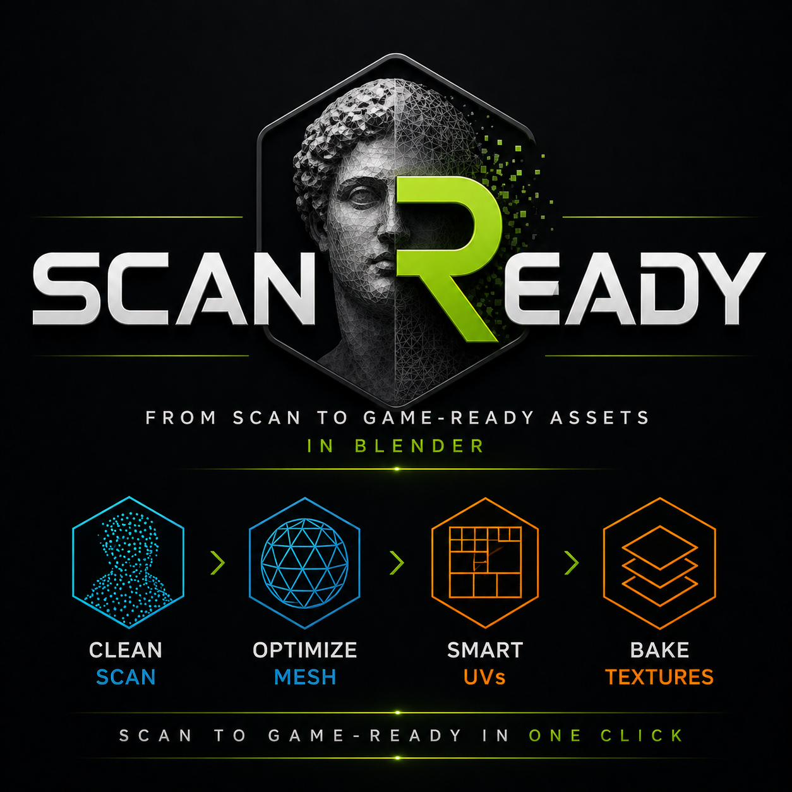
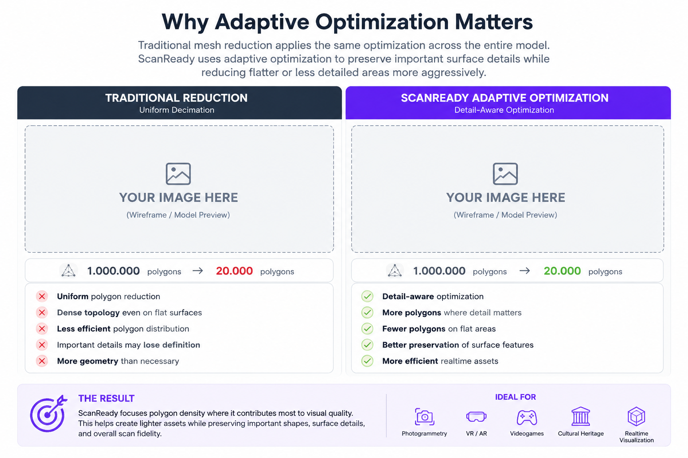

# Perché ScanReady?

Le scansioni fotogrammetriche conservano molti dettagli, ma spesso contengono milioni di poligoni, numerosi materiali e texture pesanti. ScanReady riunisce in Blender i passaggi necessari per crearne una versione più leggera: preparazione, riduzione, UV, cage e bake.

  

## Cosa semplifica

- Preparazione di scansioni importate come oggetti o gerarchie di mesh.
- Creazione e controllo di una preview low-poly.
- Generazione automatica delle UV con Smart UV Project.
- Stima del cage per trasferire i dettagli dalla sorgente.
- Bake delle mappe selezionate e collegamento dei materiali finali.
- Salvataggio delle texture per l’uso in altre applicazioni.

Puoi partire da **One Click Bake** per ottenere una prima versione oppure controllare ogni fase con gli step manuali.

## Riduzione adattiva

**Adaptive Reduce** calcola pesi che aiutano a proteggere cambi di normale, bordi e dettagli della superficie. Il modificatore Decimate usa questi pesi per semplificare maggiormente le aree meno importanti.

  

Il risultato dipende dalla scansione e dalla densità scelta. Controlla soprattutto silhouette, parti sottili e dettagli che devono restare visibili da vicino.

!!! note "Ottimizzazione e retopology"
    ScanReady usa la riduzione dei poligoni: non crea automaticamente una topologia a quad adatta all’animazione. Per modelli che devono deformarsi, può servire un passaggio di retopology dedicato.

## Dettaglio nelle texture

Le UV e il bake permettono di trasferire il dettaglio visivo dalla high-poly alla mesh ottimizzata. La geometria mantiene la forma principale, mentre le texture conservano colore e dettagli di superficie.

**Bake Materials** può distribuire il risultato su più texture set. Un layout UV efficiente aiuta a sfruttare la risoluzione disponibile, ma la scelta finale deve tenere conto anche della memoria e del numero di materiali.

## Un workflow, due modi di lavorare

| Percorso | Quando usarlo |
|---|---|
| **One Click Bake** | Per automatizzare le fasi principali e ottenere un primo risultato. |
| **Guida rapida manuale** | Per verificare separatamente riduzione, UV, cage e bake. |
| **Advanced** | Per adattare le impostazioni a una scansione difficile o a requisiti specifici. |

Se il risultato va corretto, torna allo step interessato e rigenera le fasi successive. Non occorre cambiare tutte le impostazioni avanzate per iniziare.

## A chi serve

ScanReady è pensato per artisti di fotogrammetria, environment artist e creatori di asset per videogiochi, VR, AR e visualizzazione in tempo reale. È utile anche per versioni interattive di reperti, collezioni museali e patrimonio culturale.

Conserva una copia intatta della scansione per l’archivio. La versione ottimizzata è destinata alla presentazione e all’uso in produzione; le opzioni di preparazione possono modificare la sorgente di lavoro.

## Dal modello al progetto finale

1. Importa la scansione e salva una copia del progetto.
2. Crea e controlla la preview low-poly.
3. Genera le UV e verifica il cage.
4. Esegui il bake delle texture necessarie.
5. Esporta con gli strumenti di Blender e verifica l’asset nella destinazione finale.

[Inizia con la guida rapida](quick-start.md) oppure consulta i [casi d’uso](use-cases.md).

## Filosofia ScanReady

**Veloce. Pulito. Game-ready.**

Meno configurazione ripetitiva, più controllo sul risultato della scansione.
