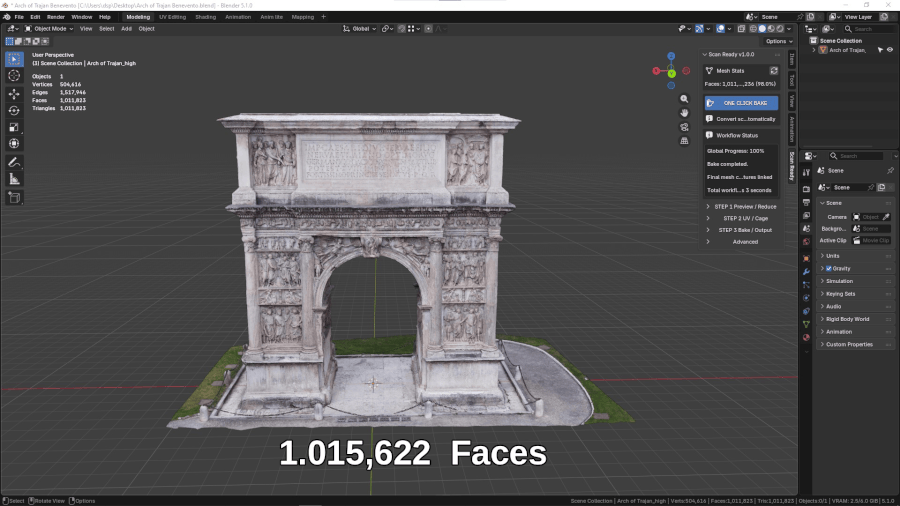
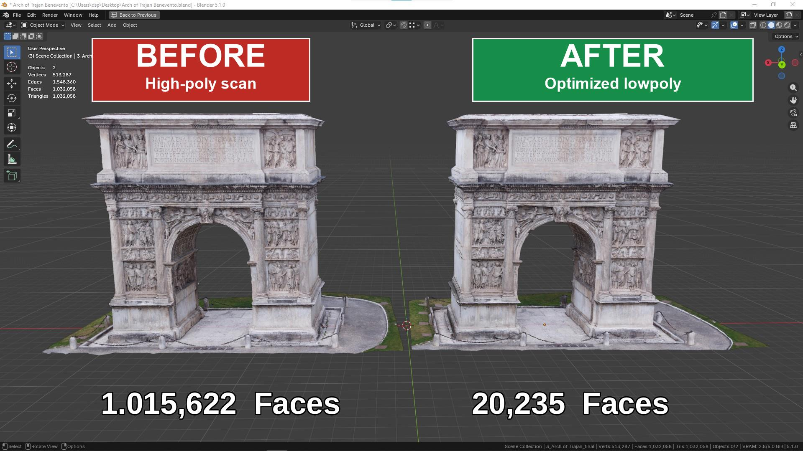

# One Click Bake

  

    

      <strong>ONE CLICK BAKE</strong> is the fastest ScanReady 1.0 workflow.
    

    

      It is designed to convert a heavy high-poly scan into a lighter baked asset with minimal setup.
      This is useful when preparing scanned models for <strong>VR, AR, videogames, realtime visualization, or interactive scenes</strong>.
    

  

  

    
  

  

Instead of manually reducing the mesh, generating UVs, preparing a cage, and configuring baking, ScanReady 1.0 runs the main process automatically.
By default, ScanReady starts from an **Optimize / Reduce** value of **0.10**. This means the lowpoly preview keeps roughly **10% of the original polygons**, producing about **90% fewer polygons**.

This default works well for many VR, game, and realtime assets. If the result needs more or less detail, adjust the value manually in **Step 1 - Preview / Reduce** after creating the lowpoly preview.

One Click Bake is automatic, but the result can still be refined afterward.

If the final model looks too heavy, or if it has been optimized too much and loses important shape detail, go back to **Step 1 - Preview / Reduce**. Adjust **Optimize / Reduce** or **Final Faces**, then click **Create Lowpoly Preview** again.

ScanReady will rebuild the optimized preview with the new settings, so you can test a lighter or more detailed version before continuing with UVs and baking again.

---

## What One Click Bake Does

When you click **ONE CLICK BAKE**, ScanReady 1.0 runs the complete scan-to-asset workflow:

1. Cleans the selected scan by removing common mesh noise such as loose polygons, floating fragments, and isolated vertices.
2. Creates a lowpoly preview from the cleaned high-poly scan.
3. Reduces the geometry to make the model lighter.
4. Generates UVs for the optimized object.
5. Creates or estimates the baking cage.
6. Bakes texture detail from the original scan.
7. Builds the final material setup.
8. Saves baked textures if **Save Images** is enabled.

The goal is to preserve the visual identity of the original scan while making the model easier to use in realtime projects.

  

---

## Why It Matters

Raw scans can be too heavy for practical production.

A scan may look good, but it can be difficult to use because it may have:

- Too many polygons.
- Heavy viewport performance.
- No clean UV layout.
- Difficult bake setup.
- Large memory usage.
- Mesh density that is not suitable for VR or videogames.

One Click Bake helps reduce that complexity.

It gives you a faster way to turn captured geometry into a cleaner, lighter, baked asset.

---

## Workflow Phases

During the operation, ScanReady 1.0 moves through the same main phases used by the manual workflow.

### Cleanup

Removes common scan debris before reduction, including loose polygons, floating geometry fragments, and isolated vertices.

### Preview

Cleans the selected scan and creates the optimized lowpoly preview.

### UV Mapping

Generates UVs for the optimized mesh.

### Cage

Estimates cage extrusion so the bake can project detail from the original scan.

### Bake

Bakes the selected texture maps and prepares the final result.

The panel shows workflow status and global progress while the process is running.

---

## When to Use One Click Bake

Use One Click Bake when:

- You want the fastest route from scan to optimized asset.
- You are processing standard photogrammetry scans.
- You need a lighter asset for VR, games, or realtime display.
- You do not need to manually inspect every step.
- You want a quick first version before doing manual refinements.

---

## Before You Click

For best results:

- Select one high-poly scan object in the 3D Viewport.
- Set **Final Faces** if you know the target mesh density.
- Choose **Texture Size** based on the level of detail you need.
- Enable **Bake Base Color**, **Bake Normal**, or **Bake Occlusion** depending on the maps you want.
- Set the **Output Folder** if you want texture files saved to disk.

---

## After the Bake

After the workflow completes, inspect:

- The final mesh density.
- The object silhouette.
- The baked material.
- The saved texture files.
- The Normal and AO maps if enabled.
- Any missing details caused by cage distance or bake settings.

If the result needs adjustment, use the manual workflow:

- **Step 1 - Preview / Reduce**
- **Step 2 - UV / Cage**
- **Step 3 - Bake / Output**

Manual steps give you more control over the same process.
