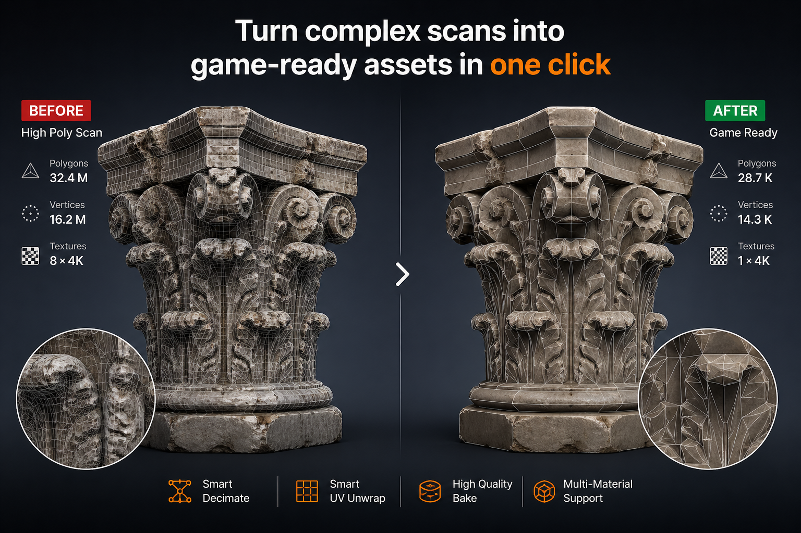

# Quick Start

Use this page when you want the fastest path from a heavy high-poly scan to an optimized baked asset.

ScanReady 1.0 is designed to simplify dense 3D scans and make them easier to use in **VR, AR, videogames, realtime viewers, and interactive Blender scenes**.

  

---

## Basic Workflow

<ol>
  <li>Open Blender and enable ScanReady 1.0.</li>
  <li>Select your high-poly scan in the 3D Viewport.</li>
  <li>Open the Sidebar with <strong>N</strong>.</li>
  <li>Select the <strong>Scan Ready</strong> tab.</li>
  <li>Click <strong>ONE CLICK BAKE</strong>.</li>
  <li>Wait for the workflow to complete.</li>
  <li>Inspect the final mesh, material, and saved texture files.</li>
</ol>

  

---

## What Happens Automatically

  

ScanReady 1.0 performs the main production steps for you:

- Creates a lighter lowpoly version of the selected scan.
- Reduces geometry to make the asset easier to manage.
- Generates UVs for the optimized mesh.
- Builds or estimates the baking cage.
- Bakes visual detail from the original scan.
- Creates the final material setup.
- Saves texture files when **Save Images** is enabled.

The goal is to keep the visual quality of the scan while making the model lighter and more practical for realtime use.

---

## Recommended First Settings

For a first test, keep most defaults and only check:

- **Final Faces** for the desired mesh density.
- **Texture Size** for the desired output resolution.
- **Bake Base Color** if you need the original color texture.
- **Bake Normal** if you want to preserve surface detail.
- **Bake Roughness** if the original high-poly material has a roughness texture that should be transferred.
- **Bake Occlusion** if you want an ambient occlusion map.
- **Output Folder** if you want textures saved to a specific location.

---

## Quick Result

After the One Click workflow, you should have:

- An optimized mesh.
- UVs on the final object.
- Baked texture information.
- A material using the baked maps.
- Saved image files if output saving is enabled.

This gives you a lighter asset that is easier to move, preview, export, and use in VR or game engines.

---

## When to Use Manual Steps

Use the manual workflow if:

- The preview mesh is too dense.
- The preview mesh is too reduced and loses important shape.
- UVs show stretching or too many islands.
- The cage misses details or covers the scan incorrectly.
- You need Normal, Roughness, or AO maps with specific settings.
- You are processing a large scan that needs safer memory settings.

Manual steps give you more control over the same process used by One Click Bake.
