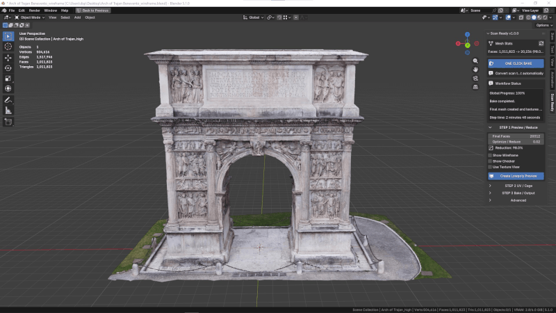
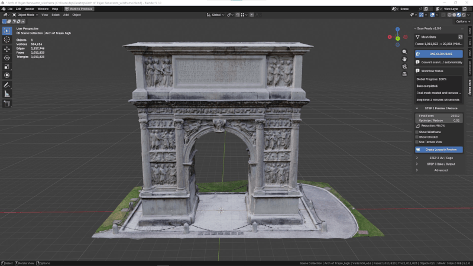

# Step 1 - Preview / Reduce

Step 1 creates an optimized lowpoly preview from the selected high-poly scan.

This is the first important step when preparing a scanned object for **VR, AR, videogames, realtime visualization, or interactive scenes**. A raw scan can contain a very high number of polygons, making it difficult to move, preview, export, or use in realtime.

ScanReady first cleans common scan debris, then reduces the model while keeping the overall shape and visual identity of the original scan.

This cleanup can remove loose polygons, floating fragments, isolated vertices, and small unwanted mesh artifacts before the lowpoly preview is generated.

---

## Why This Step Matters

High-poly scans are often too heavy for direct use.

They may cause:

- Slow viewport performance.
- Heavy Blender scenes.
- Difficult exports.
- Poor realtime performance.
- VR assets that are too dense to display smoothly.
- Game objects that are too expensive for production.

The Preview / Reduce step gives you a lighter version of the scan before continuing with UVs and baking.

It also helps remove small pieces of mesh dirt that can come from photogrammetry or 3D capture, such as loose polygons, isolated vertices, and floating fragments.

---

## Main Settings

<h3>Final Faces</h3>

Sets the target face count for the optimized lowpoly mesh.

Use a lower value for lightweight VR or game assets. Use a higher value when the object has important silhouette detail.

<h3>Optimize / Reduce</h3>

Controls the reduction strength.

Lower values create a stronger reduction and a lighter object. Higher values preserve more geometry.

<h3>Reduction</h3>

Shows the current reduction percentage based on the selected optimization settings.

  

---

## View Options

<h3>Show Wireframe</h3>

Displays the topology of the preview object.

Use it to check whether the mesh is still too dense or has been reduced too much.

  

<h3>Show Checker</h3>

Displays a checker texture.

This helps inspect UV density and distortion during later checks.

  

<h3>Use Texture View</h3>

Shows the model in a flat texture-oriented view without scene lighting.

This is useful when inspecting baked or previewed texture results.

  

<h3>Checker Mix</h3>

Controls how strongly the checker overlay appears.

  

  

<h3>Checker Scale</h3>

Changes the size of the checker squares.

Smaller squares make distortion easier to see.

  

---

## Action

Click **Create Lowpoly Preview**.

ScanReady cleans the selected high-poly scan, removes common mesh noise such as loose polygons or isolated vertices, then creates an optimized preview object.

  

When the preview looks correct, continue to:

[Step 2 - UV / Cage](step2.md)

---

## What to Check

After creating the preview, inspect:

- The overall silhouette.
- Important edges and shape details.
- Polygon density.
- Wireframe readability.
- Whether the scan is now light enough for the target use.
- Whether too much visual information was lost.

If the preview is too heavy, reduce it more.

If the preview loses important shape, increase the target density and create it again.

---

## Practical Advice for VR and Games

For VR and videogame workflows, the goal is not only to make the model look good.

The model must also be light enough to run smoothly.

A good preview should:

- Keep the recognizable shape of the original scan.
- Remove unnecessary scan density.
- Be easier to orbit and inspect in Blender.
- Be suitable for UV generation.
- Be ready for texture baking in the next steps.
