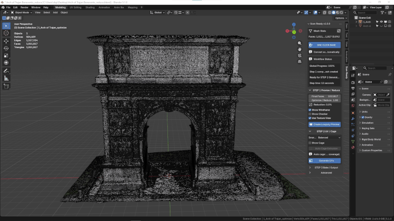
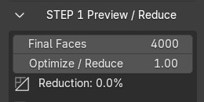
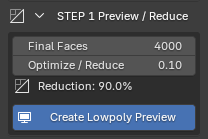

# Step 1 — Preview / Reduce

Create a lightweight optimized preview from your high-poly scan in seconds.

  

Optimize / Reduce controls how much geometry is kept in the lowpoly preview. The default value of 0.10 creates a preview with about 90% fewer polygons.

---

## Adaptive Optimization

Optimization is not applied uniformly across the entire model.

ScanReady preserves important surface detail while simplifying flatter or less detailed regions more aggressively.

This helps create cleaner and more efficient lowpoly assets for realtime workflows.

### Adaptive Reduce

Adaptive Reduce is enabled by default and helps ScanReady distribute polygon reduction more intelligently across the scan.

Instead of treating every surface the same way, it gives flatter areas more reduction and protects regions where surface detail is more important.

Use the Adaptive Reduce preset as a quick starting point:

- **Balanced** for most scans and general realtime assets.
- **Preserve Details** when the scan has important folds, sculptural forms, engravings, or close-up details.
- **Flat Surfaces** when the object contains broad simple areas that can be simplified more aggressively.
- **Hard Surface** for vehicles and hard-surface scans where a faster approximate pass should protect only stronger normal breaks.

<!-- Replace placeholder with ../img/step1-adaptive-reduce.gif -->

  

### Show Adaptive Weights

Show Adaptive Weights displays the reduction weighting directly on the model.

Use it before creating the final preview when you want to understand how ScanReady is reading the scan:

- **Red** areas are flatter regions that can be reduced more.
- **Blue / green** areas are detail-protected regions.

The visualization is only a preview aid. It helps you choose a preset and understand the reduction behavior; it is not a texture that will be exported or baked.

Adaptive Reduce weights are calculated when you click **Create Lowpoly Preview**. After the preview exists, changing **Optimize / Reduce** or **Final Faces** updates the Decimate amount using the existing weights. If you change the Adaptive Reduce preset or detailed Adaptive Reduce values, click **Create Lowpoly Preview** again to rebuild the weights with the new settings.

<!-- Replace placeholder with ../img/step1-adaptive-weights.gif -->

  

---

## Performance Improvement

Heavy scans can quickly become difficult to manage inside Blender.

### Example

- Original Scan → 1M+ polygons
- Optimized Preview → 20K polygons

This helps improve viewport responsiveness and makes the asset easier to process in realtime workflows.

---

## Non-Destructive Workflow

ScanReady never modifies the original high-poly scan.

A duplicated optimized mesh is generated automatically for the workflow, keeping the original scan untouched.

---

## Why Reduction Matters

High-poly scans are often too heavy for direct use.

They may cause:

- Slow viewport performance
- Heavy Blender scenes
- Difficult exports
- Poor realtime performance
- VR assets that are too dense to display smoothly
- Game objects that are too expensive for production

Preview / Reduce creates a lighter version of the scan before continuing with UVs and baking.

It also helps remove small mesh artifacts generated by photogrammetry or 3D capture, such as loose polygons, isolated vertices, and floating fragments.

---

Step 1 creates an optimized lowpoly preview from the selected high-poly scan.

This is the first important step when preparing a scanned object for **VR, AR, videogames, realtime visualization, or interactive scenes**.

ScanReady 1.0 first cleans common scan debris, then reduces the model while preserving the overall shape and visual identity of the original scan.

---

<h3>Optimize / Reduce</h3>

The default value is <strong>0.10</strong>.

This keeps roughly <strong>10% of the original polygons</strong>, creating a lighter lowpoly preview with approximately <strong>90% fewer polygons</strong>.

After clicking <strong>Create Lowpoly Preview</strong>, you can still adjust this value to test lighter or more detailed results.

Very dense scans with millions of polygons may still require some processing time.

Realtime updates depend on scan complexity and Blender performance.

  

---

## Main Settings

<h3>Final Faces</h3>

Sets the target face count for the optimized lowpoly mesh.

Use lower values for lightweight VR or game assets.

Use higher values when the object needs to preserve more silhouette detail.

<h3>Optimize / Reduce</h3>

Controls how strongly ScanReady reduces the selected high-poly scan.

The default value is <strong>0.10</strong>, keeping roughly <strong>10% of the original polygons</strong>.

Lower values generate lighter assets.

Higher values preserve more shape detail.

<h3>Reduction</h3>

Displays the current reduction percentage based on the selected optimization settings.

  

---

## View Options

In the current ScanReady 1.0 panel, **Show Wireframe** and **Show Checker** are placed before **STEP 1**.

These are preview tools used to inspect topology and UV readability without changing the bake workflow.

---

## Show Wireframe

Displays the topology of the preview object.

Use it to check whether the mesh is still too dense or has been reduced too aggressively.

  

---

## Show Checker

Displays a checker texture on the preview mesh.

This helps inspect UV density and texture distortion.

  

---

## Checker Mix / Checker Scale

<h3>Checker Mix</h3>

Controls how strongly the checker overlay appears on the model surface.

<h3>Checker Scale</h3>

Changes the size of the checker squares.

Smaller squares make UV stretching and distortion easier to inspect.

Larger squares are useful for quick general checks.

  

  

Checker Mix adjusts how visible the checker overlay is on top of the model surface.

  

Checker Scale changes the size of the checker pattern to make UV stretching easier to inspect.

---

## Action

Click **Create Lowpoly Preview**.

If the preview is too heavy or too simplified, adjust **Optimize / Reduce** or **Final Faces** and create the preview again.

ScanReady 1.0 cleans the selected high-poly scan, removes common mesh noise such as loose polygons or isolated vertices, then creates an optimized preview object.

Before the Decimate modifier is added, ScanReady can also run a **Pre-Decimate Merge** cleanup on the duplicated preview mesh.
This helps reduce overlapping scan polygons before optimization.

In **Advanced > Mesh Settings**, **Pre-Decimate Merge** is the single explicit weld control. Lower it if thin details are affected.

  

When the preview looks correct, continue to:

[Step 2 - UV / Cage](step2.md)

---

## What to Check

After creating the preview, inspect:

- Overall silhouette
- Important edges and shape details
- Polygon density
- Wireframe readability
- Whether the scan is light enough for the target platform
- Whether too much visual information was lost

If the preview is too heavy, reduce it further.

If the preview loses important shape detail, increase the target density and create it again.

---

## Realtime Optimization Goals

For VR and videogame workflows, the goal is not only visual quality.

The asset must also remain lightweight enough for smooth realtime performance.

A good preview should:

- Preserve the recognizable shape of the original scan
- Remove unnecessary scan density
- Improve Blender viewport responsiveness
- Be suitable for UV generation
- Be ready for texture baking in the next steps
